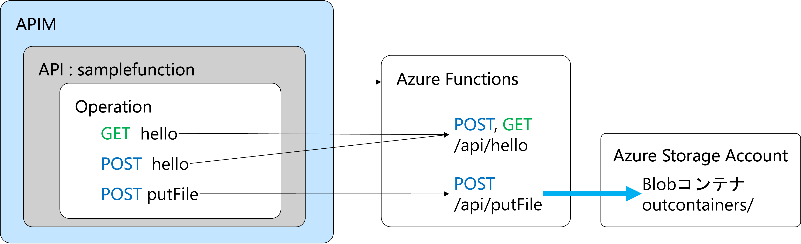
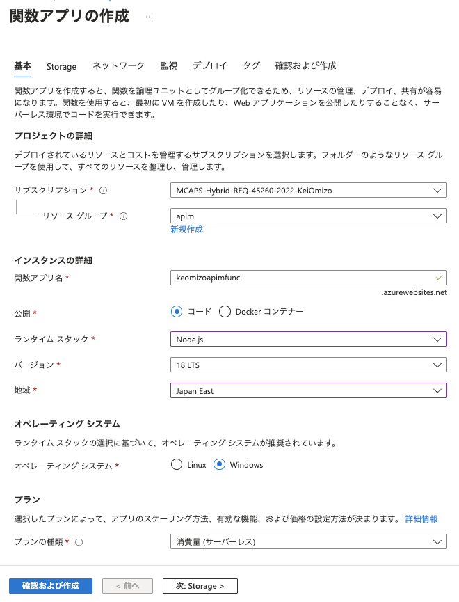
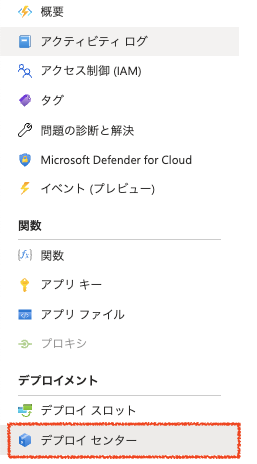
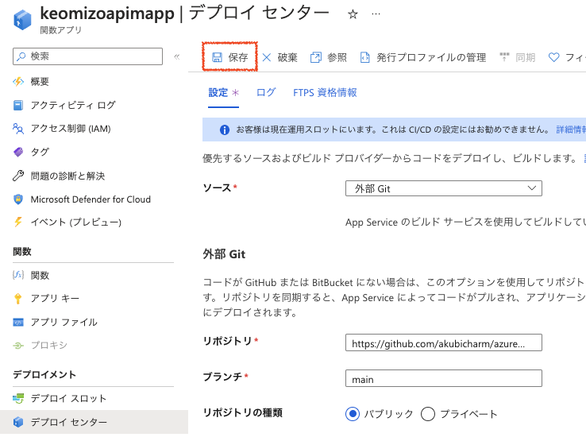
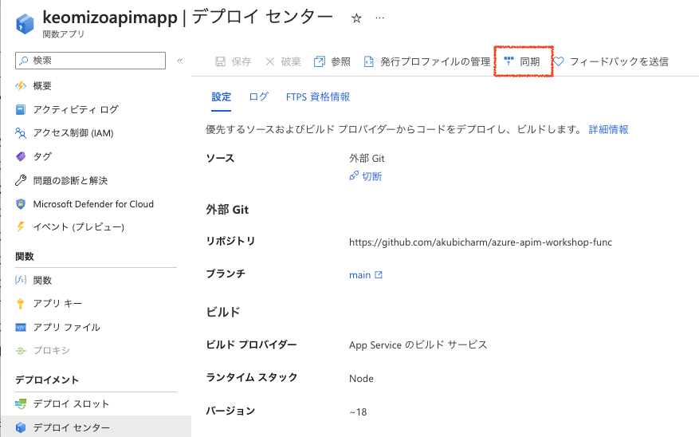
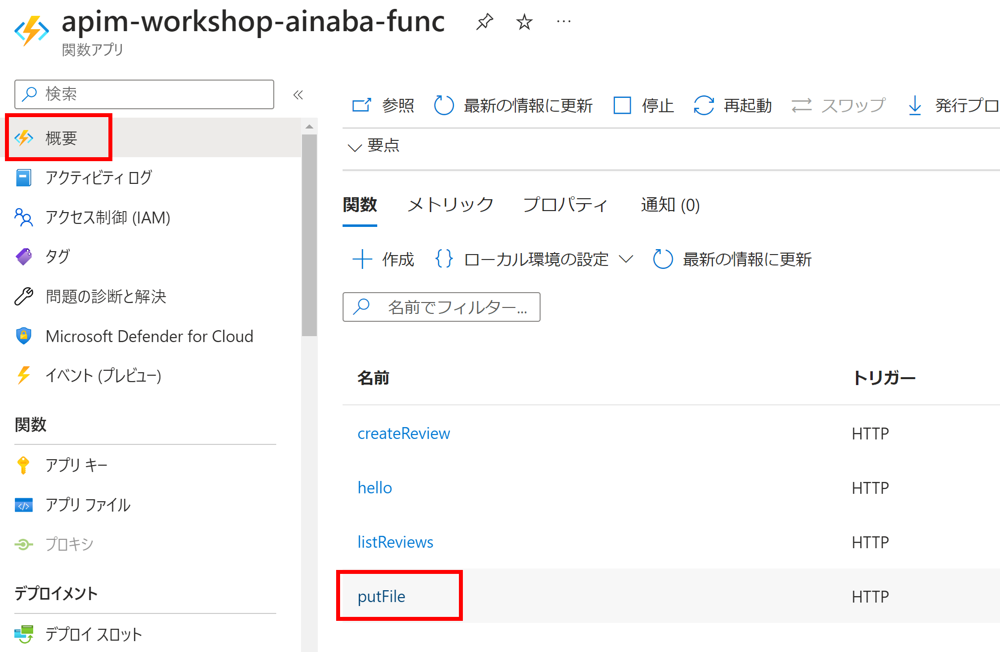
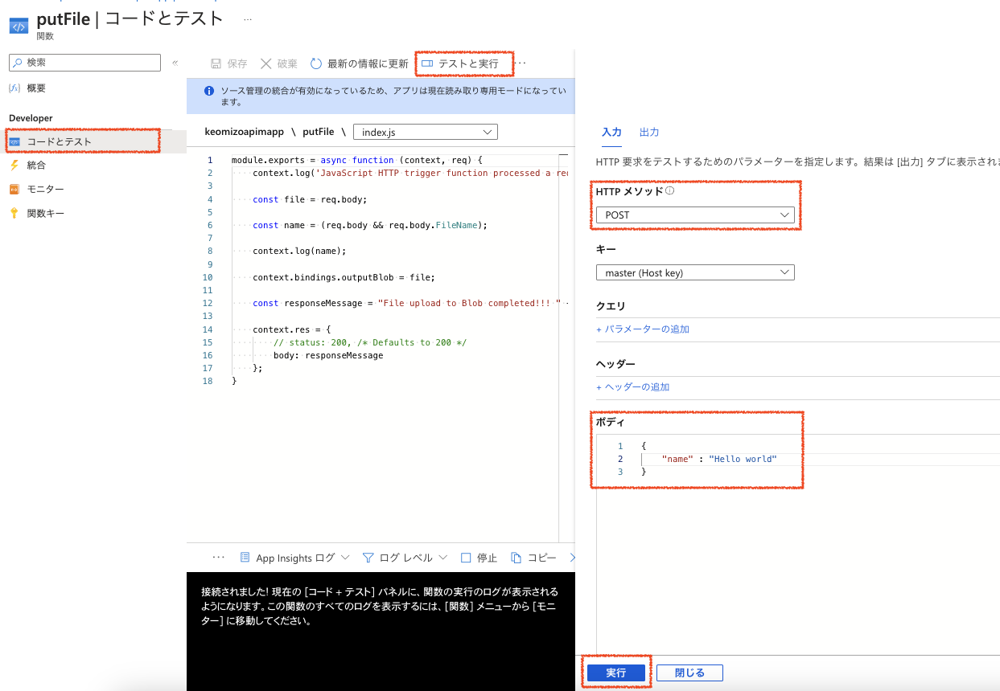
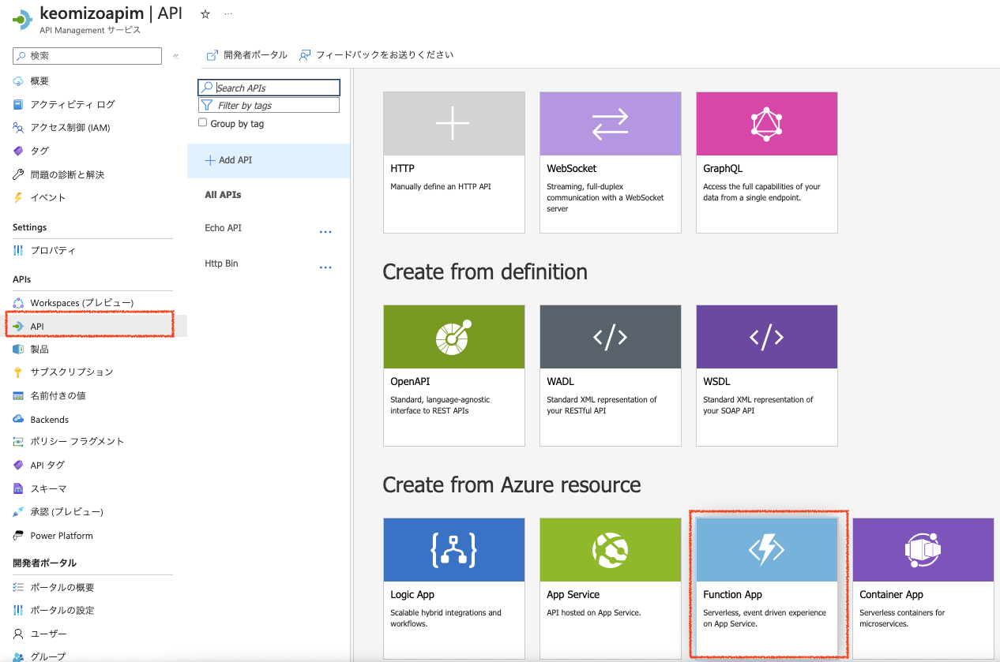
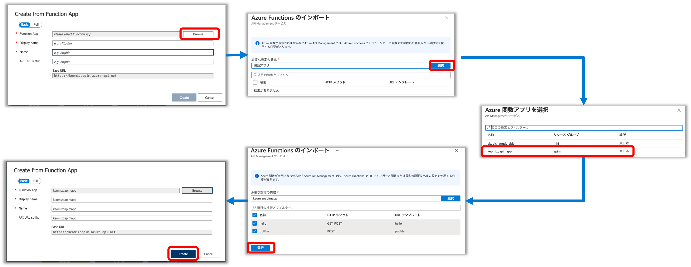
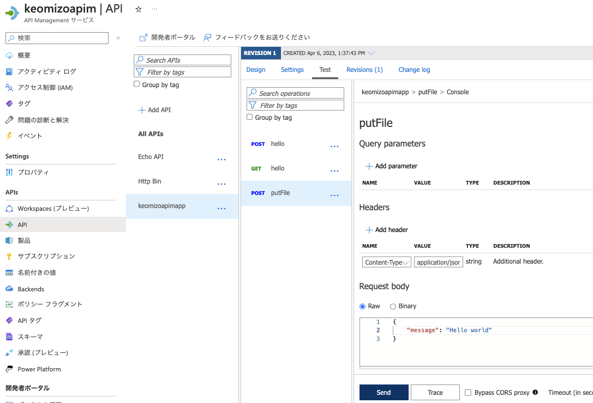

# Azure Functionとの連携

API Managementを通してAzure Functionを呼び出すための設定をしていきます。

サンプルのFunctionsは、POSTで送られてきたJSONをAzure Blob Accountのコンテナに保存します。

Azure Function連携でやることは次のとおりです

1. Azure Functionsの作成
2. Azure Functionにアプリケーションをデプロイ
3. Azure Function をAPIとして追加
4. 関数 putFileの呼び出しテスト

## Azure Functionsの準備
### 1. Azure Functions の作成

#### 1-1. このボタンをクリックして、Azure Functions のデプロイを開始　　

#### 1-2.Azure Functionの作成

__基本タブ__

|__名称__|__値__|
|---|---|
|__プロジェクト詳細__||
|サブスクリプション| ハンズオンで利用するサブスクリプションを選択||
|リソースグループ|ハンズオンで利用するリソースグループを選択。新規作成する場合は、「新規作成」をクリックしてリソースグループを入力|
|__インスタンス詳細__|
|関数アプリ名|関数アプリ名を入力。このリソース名がドメイン名の元になるので、Azure上で一意となる名称。 例)apimfunc20230401、mynamefuncws ドメイン名の例）apimfunc20230401.azurewebsites.net|
|公開|コードにチェック|
|ランタイムスタック|Node.js|
|バージョン|18LTS|
|地域|ハンズオンで利用するリージョンを選択。例）Japan East|
|__オペレーティングシステム__||
|オペレーティングシステム|Windowsにチェック|
|__プラン__||
|プランの種類|消費量（サーバーレス）|

画面下部の「確認および作成」ボタンをクリック

<!-- メモ: オペレーティングシステムをLinuxにしたら、デプロイセンターで外部Gitが選べなかった -->

### 2. Azure Functionsにアプリケーションをデプロイ

#### 2-1. 先ほどデプロイしたAzure Functionsの管理画面を開く

#### 2-2. 左Paneで「デプロイセンター」をクリック

#### 2-2. 右Paneで設定項目を入力

|名称|値|
|---|---|
|ソース|外部Git|
|リポジトリ|`https://github.com/akubicharm/azure-apim-workshop-func`|
|ブランチ|main|
|リポジトリの種類|パブリック|

画面上部の「保存」をクリック

#### 2-3. 右Pane上部の「同期」をクリックしてアプリケーションをデプロイ

#### 2-4. 左Paneで「関数」をクリック
#### 2-5. 右Paneの関数一覧の「putFile」をクリック

#### 2-6. 左Paneで「コードとテスト」をクリック
#### 2-7. 右Pane上部の「テストと実行」をクリック
#### 2-8. テストの内容を入力

|名称|値|
|---|---|
|HTTPメソッド|POST|
|キー|master(Host key)|
|ボディ|<code>{"name": "Hello world"}|

画面下部の「実行」ボタンをクリック

## Azure API Managementの設定

### 3. FunctionをAPIとして追加

#### 3-1. AzureポータルでデプロイしたAPI Managementの管理画面を開く

#### 3-2. 左Paneで「API」をクリックしてDefine a new APIのビューを表示し、「Function App」をクリック

#### 3-3. Create from Function Appのダイアログで「Browse」ボタンをクリックし、Azure Functionsのインポート画面を表示

#### 3-4. Azure Functionsのインポート画面の「選択」ボタンをクリックし、Azure関数アプリを選択画面を表示。Azure Functionsの一覧から先ほど作成したAzure Functionsを線たうk

#### 3-5. 戻ってきたAzure Functionsのインポート画面でインポートする関数のチェックをし（今回はすべてチェック）、左下の「選択」ボタンをクリック

#### 3-6. 戻ってきたCreate from Function App画面の右下の「Create」ボタンをクリック

### 4. Azure Functionの関数 putFile の呼び出しテスト

#### 4-1. Azure API Management管理ポータルの左Paneで「API」をクリック

#### 4-2. API一覧から先ほど追加したAPIをクリックし、POST hello, GET hello, POST putFile 追加されていることを確認

#### 4-3. Settingsタブを開き、Subscription requiredのチェックを外す

#### 4-4. putFileを選択し、画面上部の「Test」タブをクリック

#### 4-5. パラメータを入力してテストを実行

Headersセクションで「+Add header」をクリックして、Content-Typeを指定。

Request bodyセクションでJSONを入力。

|名称|値|
|---|---|
|__Headers__||
|NAME|Content-Type|
|VALUE|application/json|
|__Reqest body__||
|タイプ(Raw or Bin)|Rawを選択|
|ボディ|<code>{ "message": "Hello world"}</code>|

Functions用のストレージアカウントにファイルが保存されていることを確認する。

---

<a href="api-simple.md">←戻る</a>
<a href="readme.md">↑メニュー</a>
<a href="api-logicapp.md">次へ→</a>