# Logic Appとの連携

API Managementを通してAzure Logic Appsを呼び出すための設定をしていきます。

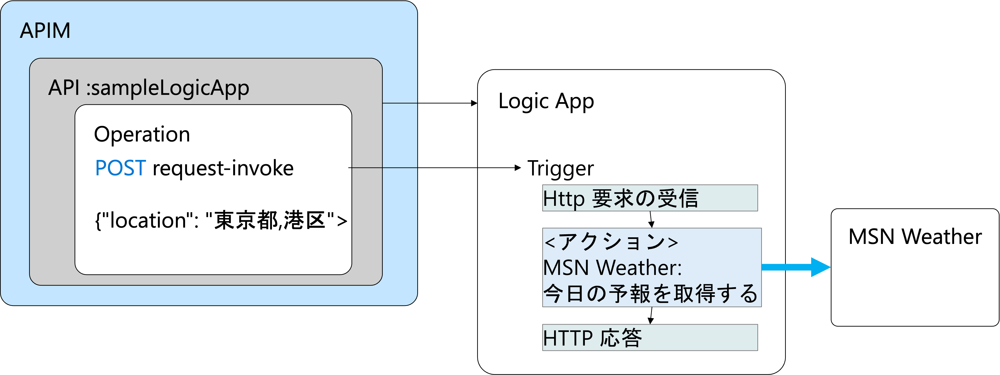

Azure Logic AppsはPaaS(Platform as a Service)で、コードをほとんど書かずに、GUIを使って自動化されたワークフローの作成を実行ができます。豊富な組み込みのコネクタをりようすることで、データベース接続や、Azureのサービス、Azure以外のサービスとの連携なども可能です。
例えば、データベースから取得した値をHTMLのテーブル形式に整形してクライアントに返すなどと行ったことも用意に実装できます。

ここでは、天気予報データ(JSON形式）を取得するワークフローを構成し、API Managementから呼び出せるようにしていきます。

Azure Logic Apps連携でやることは次のとおりです。

1. Azure Logic Appsの作成
2. Logic Appのワークフローを作成
3. Logic App をAPIとして追加
4. 呼び出しのテスト

## Logic Appの準備

### 1. Azure Logic Appsの作成

#### 1-1. このボタンをクリックして、Azure Functions のデプロイを開始　　

#### 1-2. Logic Appを作成

__基本タブ__

|__名称__|__値__|
|---|---|
|__プロジェクト詳細__||
|サブスクリプション| ハンズオンで利用するサブスクリプションを選択||
|リソースグループ|ハンズオンで利用するリソースグループを選択。新規作成する場合は、「新規作成」をクリックしてリソースグループを入力|
|__インスタンスの詳細__||
|ロジックアプリ名| 名称を入力|
|地域|Japan East|
|__プラン__||
|プランの種類|消費を選択|
|ゾーン冗長（プレビュー）|無効|

画面下部の「確認および作成」ボタンをクリック

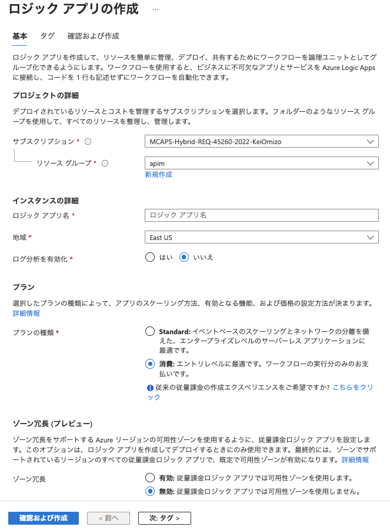

設定内容の確認ができたら、画面下部の「作成」ボタンをクリック
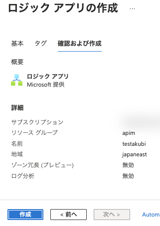

作成が終わったら「リソースに移動」ボタンをクリック

### 2. ワークフローの作成

#### 2-1. テンプレートから「HTTP要求と応答」をクリックに、ダイアログで「このテンプレートを使用する」ボタンをクリック
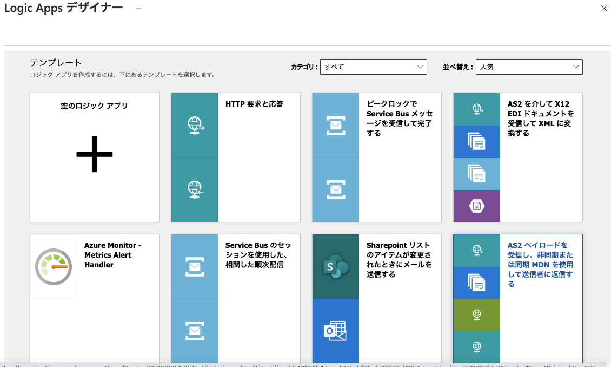
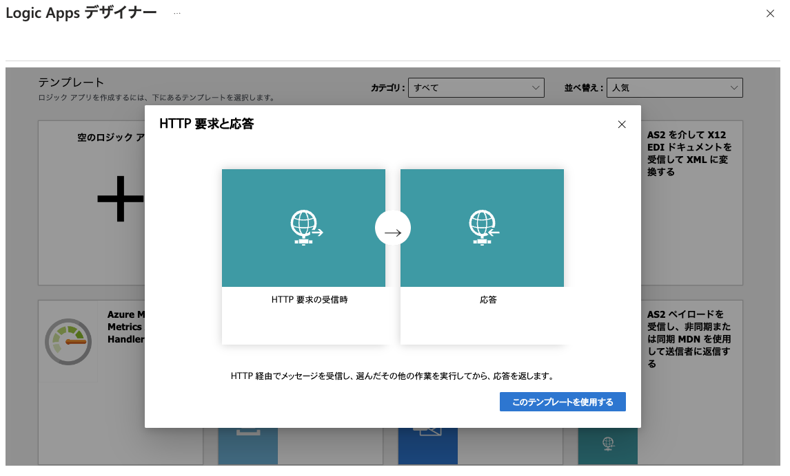

#### 2-2. 「＋」をクリックしプルダウンメニューで「アクションの追加」をクリック
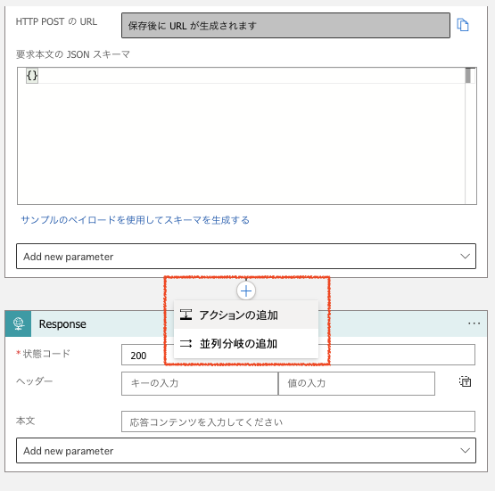

#### 2-3. 操作を選択してくださいのダイアログの検索画面で「MSN Weather」と入力してアクションを検索し、「今日の天気を取得する」のアクションをクリック

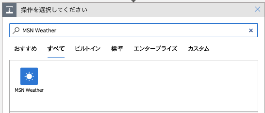

#### 2-4. 場所を入力
場所の例
* 東京都,港区

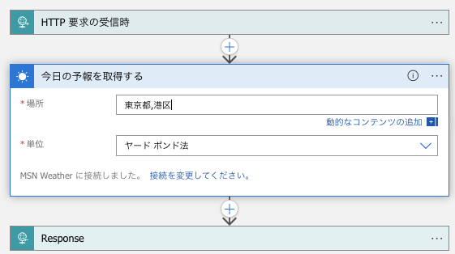

#### 2-5. Responseの本文のテキストフィールドをクリックして、動的コンテンツの一覧を表示。一覧から「responses」をクリック
こうすることで、今日の予報を取得するのアクションの結果がレスポンスの本文に設定される。

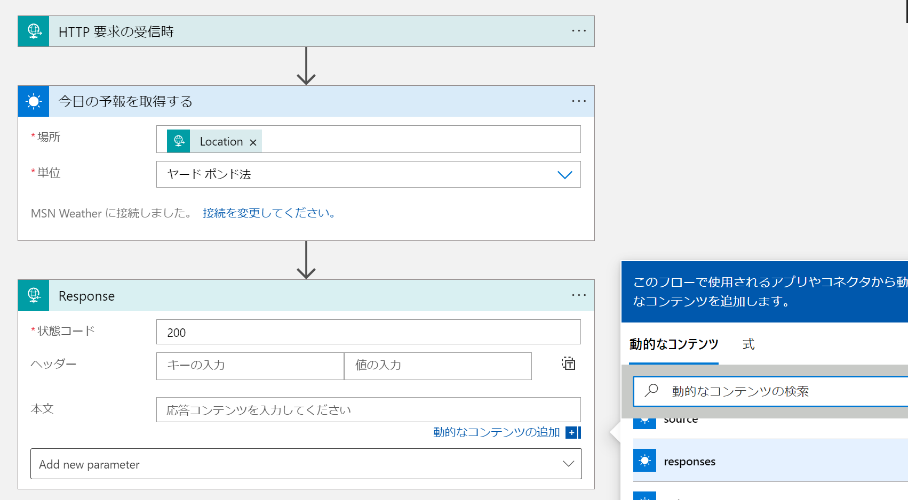

#### 2-6. 画面上部の「保存」ボタンをクリック

#### 2-7. 画面上部の「トリガーの実行」ボタンをクリックし、プルダウンメニューの「実行」をクリック

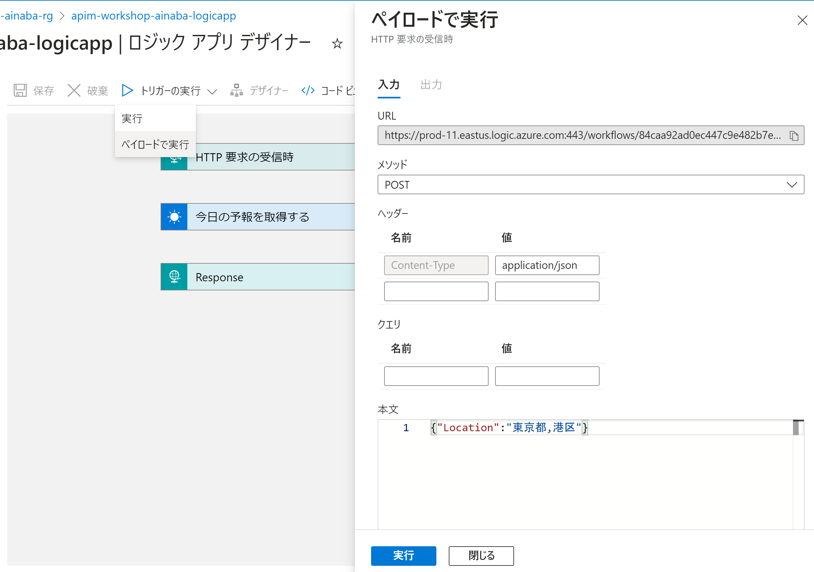

### 3. Logic Appを　APIとして追加

#### 3-1. APIManagementの管理画面を表示し、左Paneの「API」をクリック
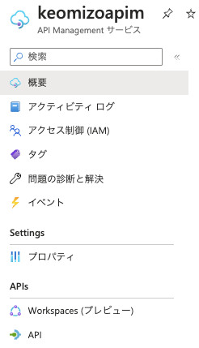

#### 3-2. 右PaneのCreate from Azure resourceのセクションの「Logic App」をクリック
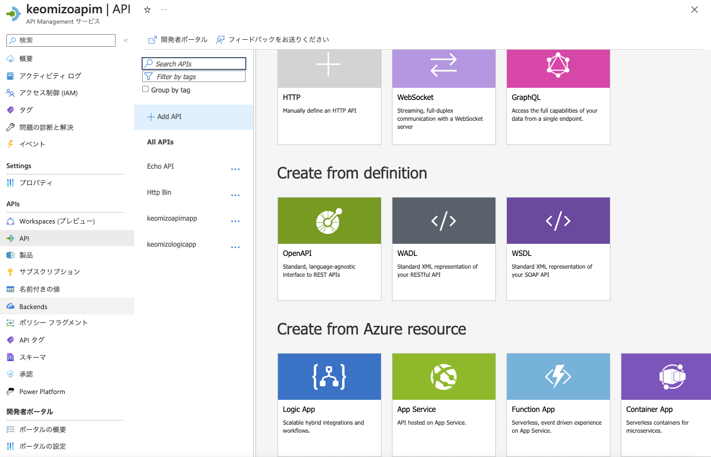

#### 3-3. Create fron Logic Appのダイアログの「Browse」ボタンをクリック

#### 3-4. インポートするロジックアプリの選択画面で一覧から作成したロジックアプリを選択し画面下部の「選択」ボタンをクリック

#### 3-5. 戻ってきたCreate from Logic Appダイアログの右下の「Create」ボタンをクリック

### 4. 呼び出しのテスト

#### 4-1. APIMに追加したロジックアプリのSettingを開き「Subscription Required」のチェックを外し、画面下部の「Save」ボタンをクリック
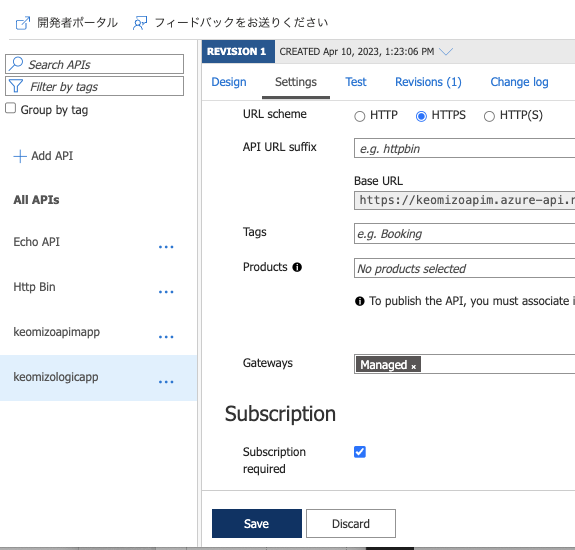

#### 4-2. 右Pane上部の「Test」タブをクリックし、オペレーション一覧から「POST request-invoke」をクリック

#### 4-3. Request Bodyに天気予報を取得するロケーションを入力し画面下部の「Send」ボタンをクリック
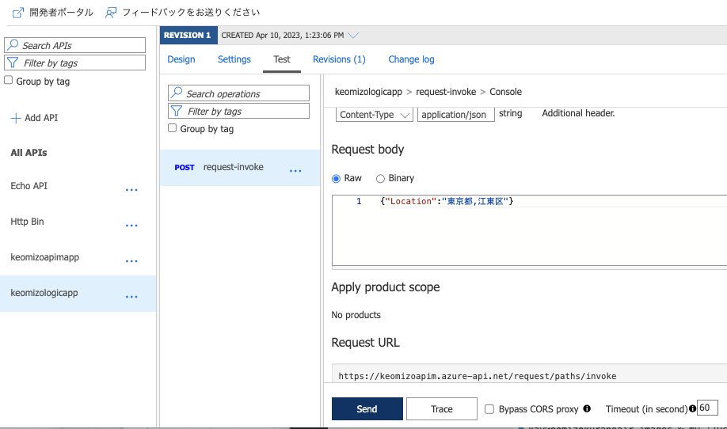

