# APIM の監視

APIM のログやメトリックを利用するための設定をしていきます。

ここでやることは以下の通りです。

1. Log分析ワークスペースの作成
2. Application Insightsの作成
3. 既存 APIM での Application Insighitsの有効化
4. APIMのログとメトリクスの参照

## ログ収集の準備

既存のAPIMでApplication Insightsを利用するために、Log分析ワークスペースの作成、Application Insightsの作成、APIMへの設定を行います。

### 1. Log分析　ワークスペースの作成

#### 1-1. ワークショップで利用するリソースグループを選択

#### 1-2. 画面上部の「+作成」をクリック

#### 1-3. マーケットプレイスの検索テキストフィールドにOMSと入力してリターンキーを押す

ログ分析(OMS)が表示されるので、それをクリックしてLog Analyticsワークスペースの作成を開始します。

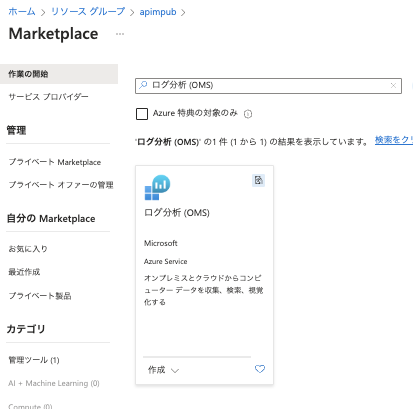

#### 1-4. 基本タブでパラメータを入力してワークスペースを作成

次のパラメータを入力し、画面下部の「確認および作成」をクリックします。

入力値の検証が終了したら、画面下部の「作成」ボタンをクリックします。

|名称|値|
|---|---|
|__プロジェクトの詳細__||
|サブスクリプション|ワークショップで利用するサブスクリプションを選択|
|リソースグループ|ワークショップで利用するリソースグループを選択|
|__インスタンスの詳細__||
|名前|任意の名称を入力|
|地域|Japan East|

### 2. Application Insightsの作成

#### 2-1. ワークショップで利用するリソースグループを選択

#### 2-2. 画面上部の「+作成」をクリック

#### 2-3. マーケットプレイスの検索テキストフィールドに「Application Insights」と入力してリターンキーを押す

Applicaiton Insightsが表示されるので、それをクリックしてアプリケーションインサイトの作成を開始します。

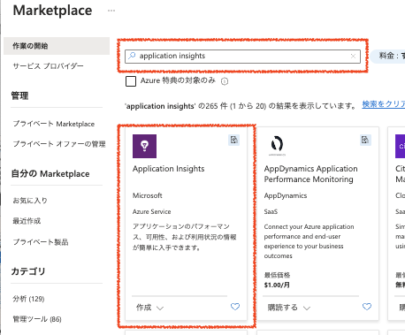

#### 2-4. 基本タブでパラメータを入力してアプリケーションインサイトを作成

|名称|値|
|---|---|
|__プロジェクトの詳細__||
|サブスクリプション|ワークショップで利用するサブスクリプションを選択|
|リソースグループ|ワークショップで利用するリソースグループを選択|
|__インスタンスの詳細__||
|名前|任意の名称を入力|
|リソースモード|ワークスペース|
|__ワークスペースの詳細__||
|サブスクリプション|ワークショップで利用するサブスクリプションを選択|
|Log Analyticsワークスペース|前の手順で作成したログ分析ワークスペースを選択|

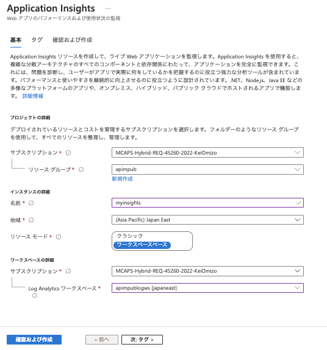

### 3. API ManagementでのApplication Insightsの有効化

#### 3-1. APIMの管理画面の左Paneで「Application Insighits」をクリックし、右Pane上部の「+追加」をクリック

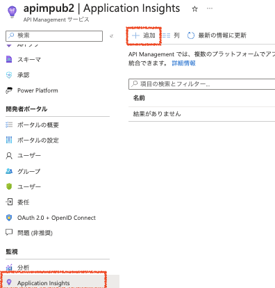

#### 3-2. ロガーの追加ダイアログで、前の手順で作成したApplication Insightsを選択して「作成」ボタンをクリック

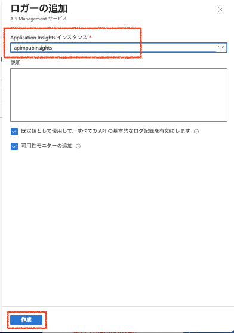

#### 3-3. API 呼び出しと Application Insights へのログの転送

Application Insights の設定を行う以前の API 呼び出しは Application Insights にデータが転送されていません。
このタイミングで Module 1 ~ 6 で実施したような API 呼び出しを数回行ってから、下記の手順に進んでください。

## ４. API Managementのログとメトリクスの利用

### 分析
APIM管理画面の左Paneで分析を選択すると、タイムラインのグラフや、どの地域から呼び出されているかなどを参照できる。
> この機能は前述の Application Insights の設定なしでも既定の状態で利用できます。

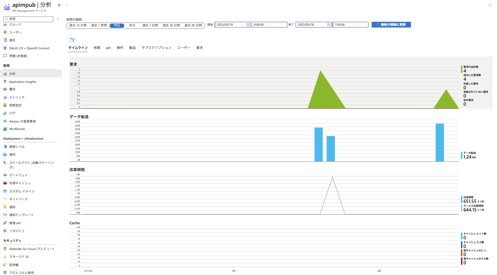

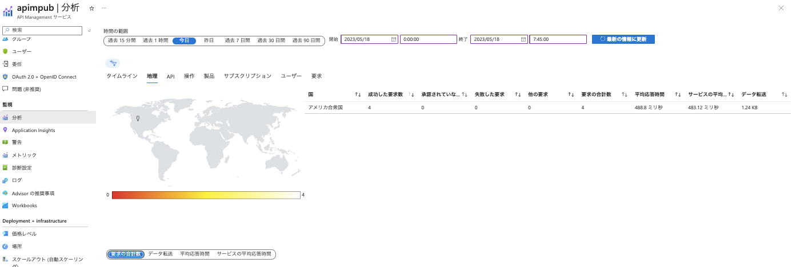

### メトリック
APIM管理画面の左Paneでメトリックを選択すると、Request数などを参照することができる。

メトリックの種類で「Requests」を選択肢、分割を適用するで「Gateway Response Code Category」を選択すると、レスポンスコードのカテゴリごとの要求数がグラフ表示される。

> この機能は前述の Application Insights の設定なしでも既定の状態で利用できます。

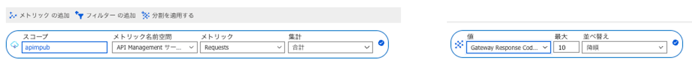

このように指定をしたメトリックのグラフは次のようになります。

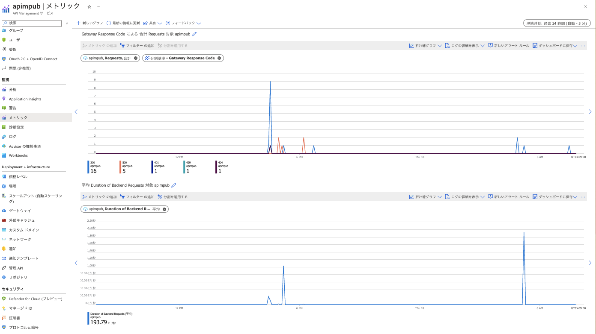

### Application Insightsの利用

#### アプリケーションマップ

APIMからバックエンドへの呼び出しの結果を可視化します。マップ上のコンポーネントをクリックすると、右側に詳細が表示され、詳細な情報にドリルダウンすることができます。

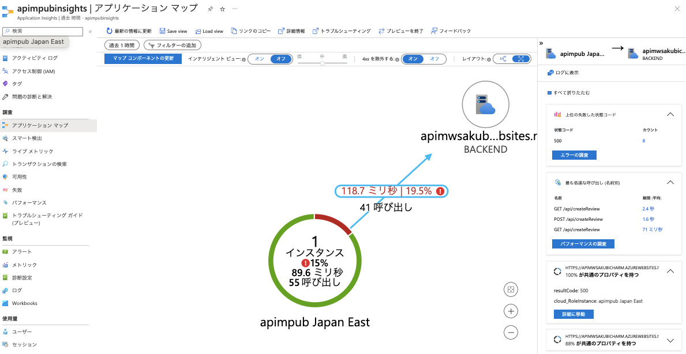

#### トランザクションの検索

API呼び出しのトランザクションごとの詳細な情報をドリルダウンして参照することができます。

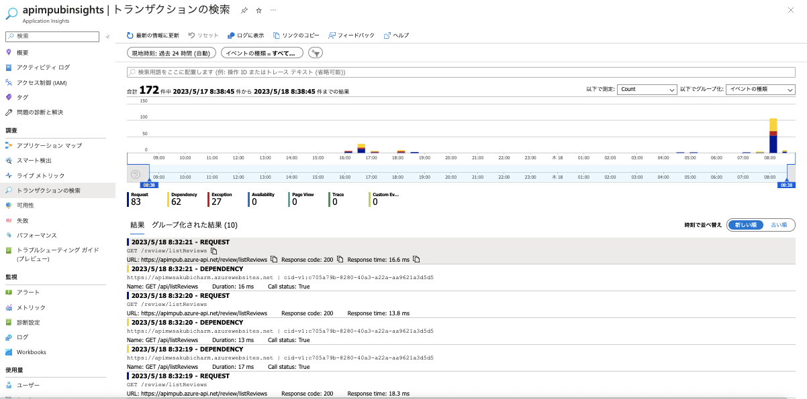

