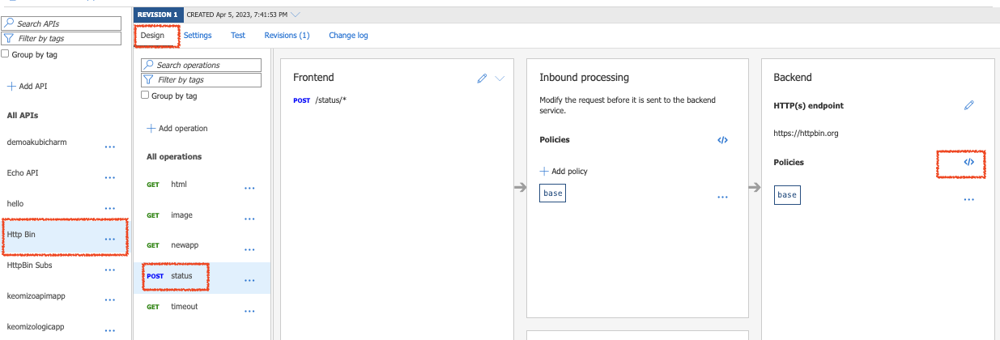
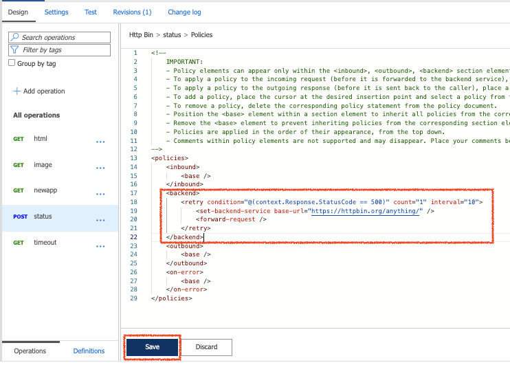
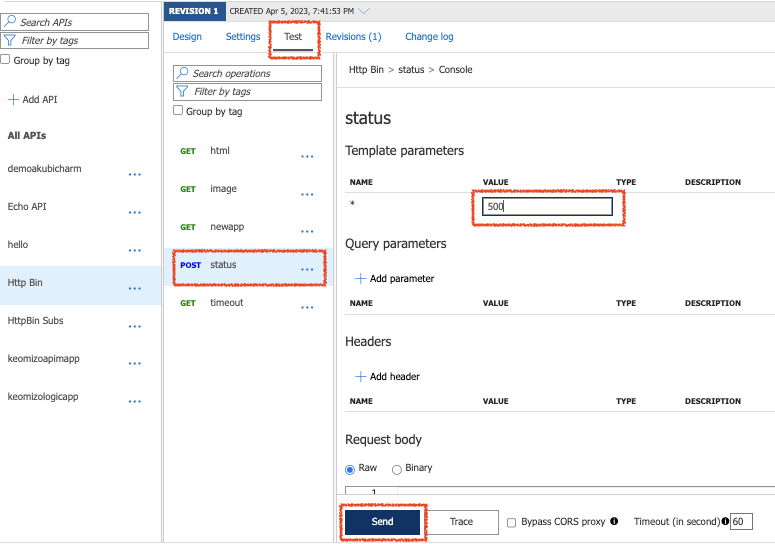
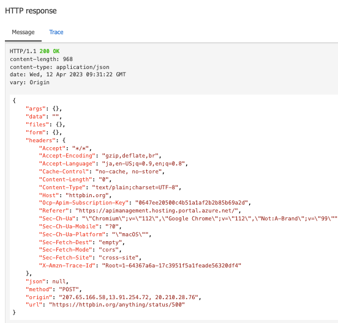
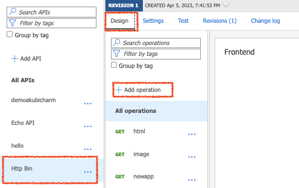
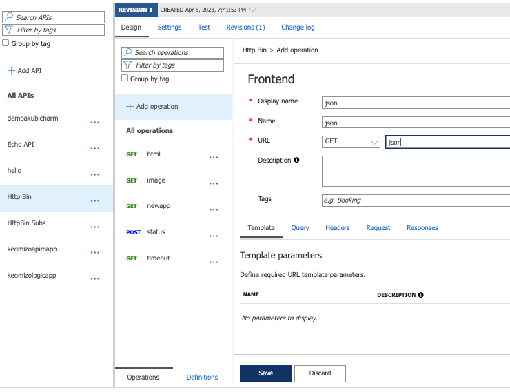
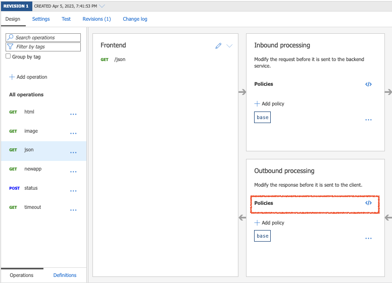
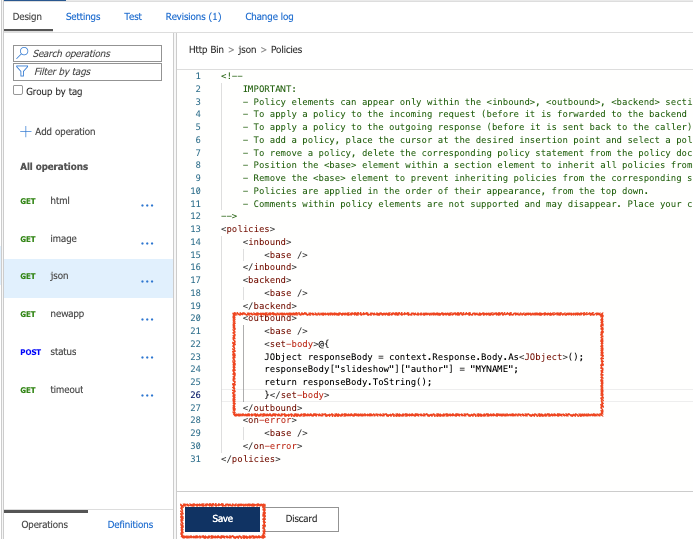

# ポリシーの利用

ポリシーは、トラフィックの制御やバックエンドAPIの呼び出しなど、バックエンドの呼び出し前後の処理を定義します。
ポリシーの適用範囲はグローバル（すべてのAPI)から各オペレーション単位までさまざまなスコープで適用できます。


ここでは、オペレーション単位でのポリシーの設定をしていきます。

ポリシー設定でやることは次のとおりです。

1. Http bin の GET html 呼び出しの流量制御 (inbound policy)
2. モックレスポンスの作成 (inbound policy)
3. バックエンドサービス呼び出しのリトライ (backend policy)
4. レスポンスの書き換え (outbound policy)


モックレスポンスを利用すると、バックエンドのAPIの実装までも仮のレスポンスを返すことができるので、クライアントの開発を進めることができるようになります。

## 1. 流量制御
流量制御(rate-limit)のポリシーを設定して、外部のURLを呼ぶHttp BinのGET html操作の呼び出しが同じIPアドレスからは、60秒間に1回だけできるように設定します。

#### 1-1. HttpBin API を選択、右Pane上部の「Design」タブを選択して、「GET html」をクリック


#### 1-2. Inbound processingの「+Add policy」をクリックしてポリシー設定を開始


#### 1-3. 「Limit call rate」をクリック


#### 1-4. 流量制御のポリシーを入力後、画面下部の「Save」ボタンをクリック

|名称|値|
|---|---|
|Number of calls|1|
|Renewal period(in secondds)|60|
|Counter key|IP address|
|Increment condition|Any request|

画面下部の「Save」ボタンをクリック


#### 1-5. 右Pane上部の「Test」タブをクリックし、オペレーション一覧の「GET html」をクリックし、Request URLを確認


#### 1-6. ブラウザでURLを複数回開く

rate-limit に引っかからない場合は HTML が表示され、引っかかった場合は下記のようなエラーが表示される。

```json
{ "statusCode": 429, "message": "Rate limit is exceeded. Try again in 23 seconds." }
```

#### 1-7. Inbound processingの`</>`ボタンをクリックしてエラー処理をカスタマイズ


#### 1-8. on-errorセクションを編集して「Save」ボタンをクリック

```
    <on-error>
        <base />
        <return-response>
            <set-body>Too many calls!!!</set-body>
        </return-response>
    </on-error>
```

#### 1-9. ブラウザでURLを複数回開く

rate-limit に引っかからない場合は HTML が表示され、引っかかった場合はポリシーに記述したメッセージ `Too many calls!!!`が表示される。


## 2. モックレスポンス

https://learn.microsoft.com/ja-jp/azure/api-management/mock-response-policy

#### 2-1. API一覧の「Http Bin」をクリック「+ Add operation」をクリック

#### 2-2. 右Paneの「Response」タブをクリック

#### 2-3. Frontendの属性を入力し、Responsesセクションの「+Add response」ボタンをクリックしプルダンから「200 OK」を選択

__Frontend__

|名称|値|
|---|---|
|Display name|newapp|
|Name|自動入力|
|URL|GET newapp|


#### 2-2. Replisentationsセクションの「+ Add replisentation」をクリックし「application/json」をクリック


#### 2-3. サンプルにJSONを貼り付けて画面下部の「Save」ボタンをクリック
```
{ "name"   : "John Smith",
  "sku"    : "20223",
  "price"  : 23.95,
  "shipTo" : { "name" : "Jane Smith",
               "address" : "123 Maple Street",
               "city" : "Pretendville",
               "state" : "NY",
               "zip"   : "12345" },
  "billTo" : { "name" : "John Smith",
               "address" : "123 Maple Street",
               "city" : "Pretendville",
               "state" : "NY",
               "zip"   : "12345" }
}
```

#### 2-4. inbound processingの「+ Add Policy」をクリックし「Mock responses」をクリック


#### 2-5. API Management responseを確認して、画面下部の「Save」ボタンをクリック


#### 2-6. レスポンスを編集する場合は、Frontendの編集アイコンをクリックしてフロントエンドのエディタを開く


## 3. バックエンドサービスの呼び出しのエラー時のリトライ

バックエンドサービスのレスポンスコードが500だった場合に、リトライとして別のサービスを呼び出すbackend policy を設定します。

#### 3-1. API一覧の「Http Bin」をクリックし、右Paneの「Design」タブをクリック

#### 3-2. Operation一覧で「POST status」をクリックし、BackendのPoliciesの右の「</>」ボタンをクリックしてポリシーの編集を開始



#### 3-3. backend を下記内容に書き換えて画面下部の「Save」ボタンをクリック

```xml
    <backend>
        <retry condition="@(context.Response.StatusCode == 500)" count="1" interval="10">
            <choose>
                <when condition="@(context.Response.Body != null)">
                    <set-backend-service base-url="https://httpbin.org/anything/" />
                </when>
            </choose>
            <forward-request />
        </retry>
    </backend>
```

ここで指定している[retry ポリシー](https://learn.microsoft.com/ja-jp/azure/api-management/retry-policy) は子ポリシーを 1 回実行し、
条件(condition）に指定されているようにレスポンスコードが 500 である場合に、上限回数(count) を1 回として、子ポリシーを10秒間隔(interval)で再試行します。

子ポリシーには以下の 2 つが指定されています。
- choose
  - レスポンスボディが null でない、すなわち過去に 1 回以上のリトライが行われている場合に、`set-backend-service` でバックエンドサービスを切り替えています
  - 初回実行の場合は バックエンドサービスはそのままになるので `https://httpbin.org/status/[ステータスコード]` になります
- forward-request
  - バックエンド API にリクエストを転送します
  - これは上位のポリシーで指定されている既定の挙動ですが、retry ポリシーの含めるために base ポリシーが除去されています



#### 3-4. 画面上部の「Test」タブをクリックしてテスト画面を表示
#### 3-5. Operationの一覧から先ほど追加した 「POST status」を選択
#### 3-6. Template Parameterに「500」を入力し、画面下部の「Send」ボタンをクリック



バックエンドAPIとして`https://httpbin.org/status/500`を呼び出し、 ResponseCodeが500なので1度リトライし`https://httpbin.org/anything/500`のリクエストがルーティングされその応答が返ってきます。



## 4. レスポンスの書き換え

`https://httpbin.org/json`を呼び出すOperationを追加し、レスポンスの内容を変更して呼び出し元に返すOutbound Policyを設定します。
`https://httpbin.org/json`はレスポンスとして以下のようなJSONが返ってくるので、`slideshow.author`の部分を書き換えるようにOutbound policyを設定します。

```
{
  "slideshow": {
    "author": "Yours Truly",
=== 以下、省略 ===
```

#### 4-1. API一覧からHttp binを選択し、画面上部の「Design」タブをクリックしてデザイン画面を表示



#### 4-2. 「+Add operation」をクリックしてOperationの詳細を入力
|名称|値|
|---|---|
|Display name|json|
|Name|自動入力されるのでそのまま|
|URL|メソッド: GET、コンテキストパス: /json|

画面下部の「Save」ボタンをクリック



挙動の差異を確認するためにここで一度テスト実行しておきます。

#### 4-3. 右PaneのOutbound processingのPoliciesの右の「</>」ボタンをクリック



#### 4-4. outboundの部分を下記に書き換えて画面下部の「Save」をクリック

```
    <outbound>
        <base />
        <set-body>@{
        JObject responseBody = context.Response.Body.As<JObject>();
        responseBody["slideshow"]["author"] = "MYNAME";
        return responseBody.ToString(); 
        }</set-body>
    </outbound>
```


---

<a href="api-logicapp.md">←戻る</a>
<a href="readme.md">↑メニュー</a>
<a href="api-subscription.md">→ 次へ</a>

