# ポリシーの利用

ポリシーは、トラフィックの制御やバックエンドAPIの呼び出しなど、バックエンドの呼び出し前後の処理を定義します。
ポリシーの適用範囲はグローバル（すべてのAPI)から各オペレーション単位までさまざまなスコープで適用できます。

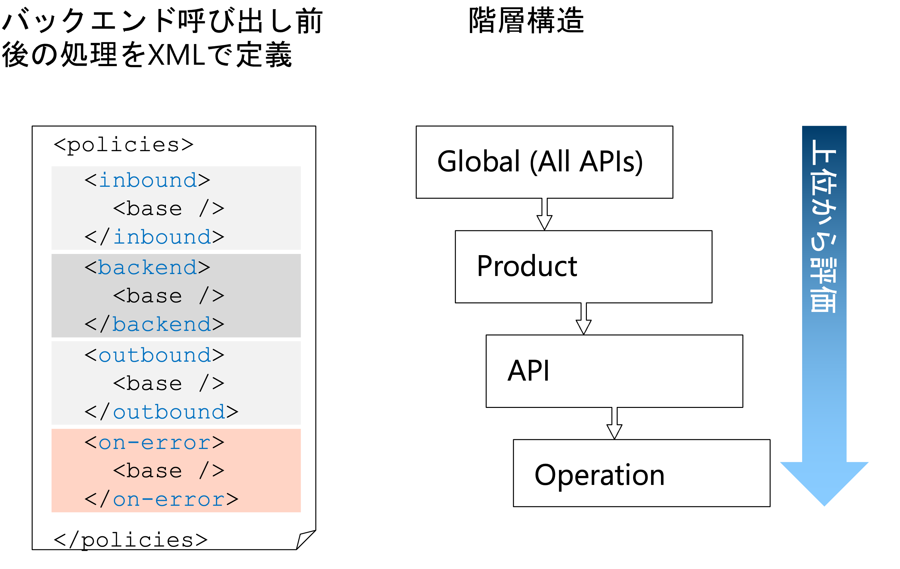
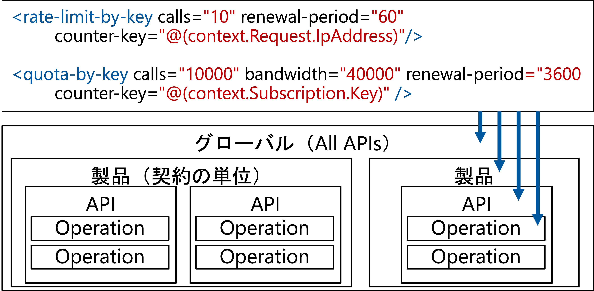


ここでは、オペレーション単位でのポリシーの設定をしていきます。

ポリシー設定でやることは次のとおりです。

1. Http bin の GET html 呼び出しの流量制御
2. モックレスポンスの作成


モックレスポンスを利用、バックエンドのAPIの実装までも仮のレスポンスを返すことができるので、クライアントの開発を進めることができるようになります。

## 1. 流量制御
流量制御(late-limit)のポリシーを設定して、外部のURLを呼ぶHttp BinのGET html操作の呼び出しが同じIPアドレスからは、60秒間に1回だけできるように設定します。

#### 1-1. HttpBinのGET htmlを選択し、右Pane上部の「Design」タブをクリック
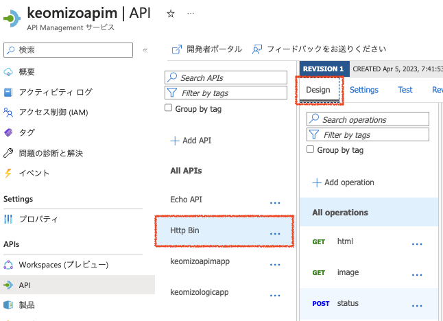

#### 1-2. Inbound processingの「+Add policy」をクリックしてポリシー設定を開始
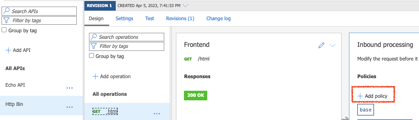

#### 1-3. 「Limit call rate」をクリック


#### 1-4. 流量制御のポリシーを入力後、画面下部の「Save」ボタンをクリック

|名称|値|
|---|---|
|Number of calls|1|
|Renewal period(in secondds)|60|
|Counter key|IP address|
|Increment condition|Any request|

画面下部の「Save」ボタンをクリック

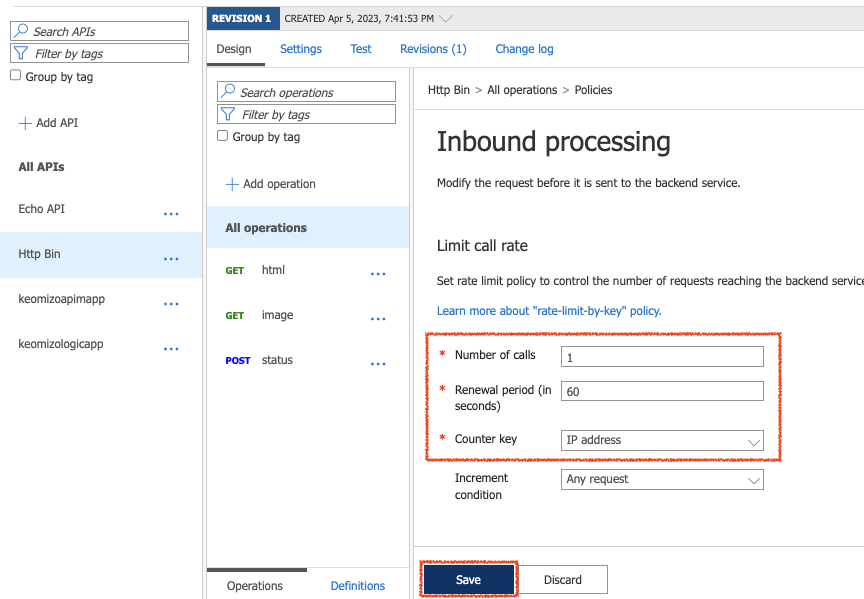


#### 1-5. 右Pane上部の「Test」タブをクリックし、オペレーション一覧の「GET html」をクリックし、Request URLを確認
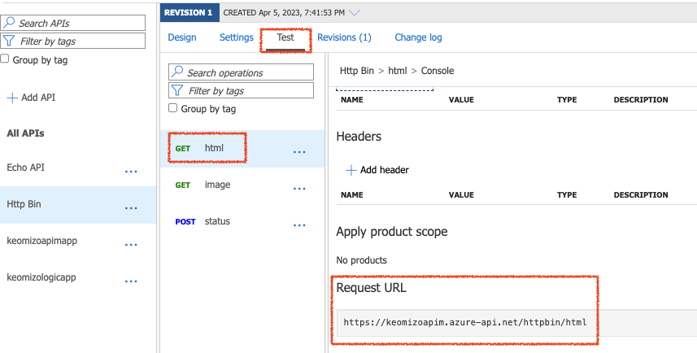


#### 1-6. ブラウザでURLを複数回開く

#### 1-7. Inbound processingの`</>`ボタンをクリックしてエラー処理をカスタマイズ
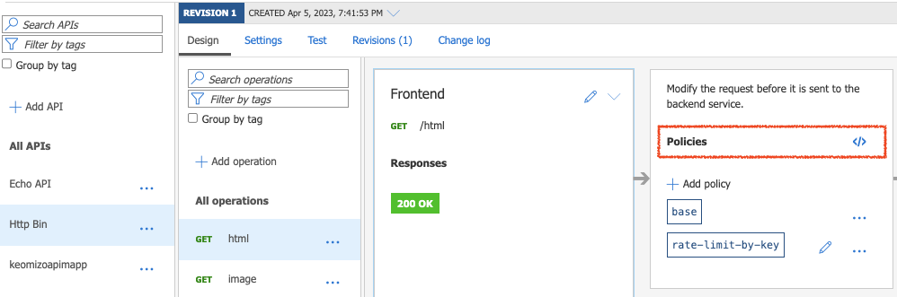

#### 1-8. on-errorセクションを編集して「Save」ボタンをクリック

```
    <on-error>
        <base />
        <return-response>
            <set-body>Too many calls!!!</set-body>
        </return-response>
    </on-error>
```


## 2. モックレスポンス

https://learn.microsoft.com/ja-jp/azure/api-management/mock-response-policy

#### 2-1. API一覧の「Http Bin」をクリック「+ Add operation」をクリック

#### 2-2. 右Paneの「Response」タブをクリック

#### 2-3. Frontendの属性を入力し、Responsesセクションの「+Add response」ボタンをクリックしプルダンから「200 OK」を選択

__Frontend__

|名称|値|
|---|---|
|Display name|newapp|
|Name|自動入力|
|URL|GET newapp|


#### 2-2. Replisentationsセクションの「+ Add replisentation」をクリックし「application/json」をクリック
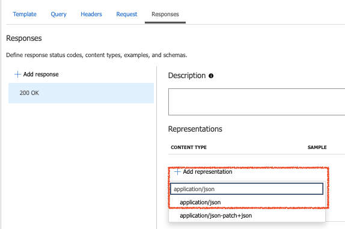

#### 2-3. サンプルにJSONを貼り付けて画面下部の「Save」ボタンをクリック
```
{ "name"   : "John Smith",
  "sku"    : "20223",
  "price"  : 23.95,
  "shipTo" : { "name" : "Jane Smith",
               "address" : "123 Maple Street",
               "city" : "Pretendville",
               "state" : "NY",
               "zip"   : "12345" },
  "billTo" : { "name" : "John Smith",
               "address" : "123 Maple Street",
               "city" : "Pretendville",
               "state" : "NY",
               "zip"   : "12345" }
}
```

#### 2-4. inbound processingの「+ Add Policy」をクリックし「Mock responses」をクリック
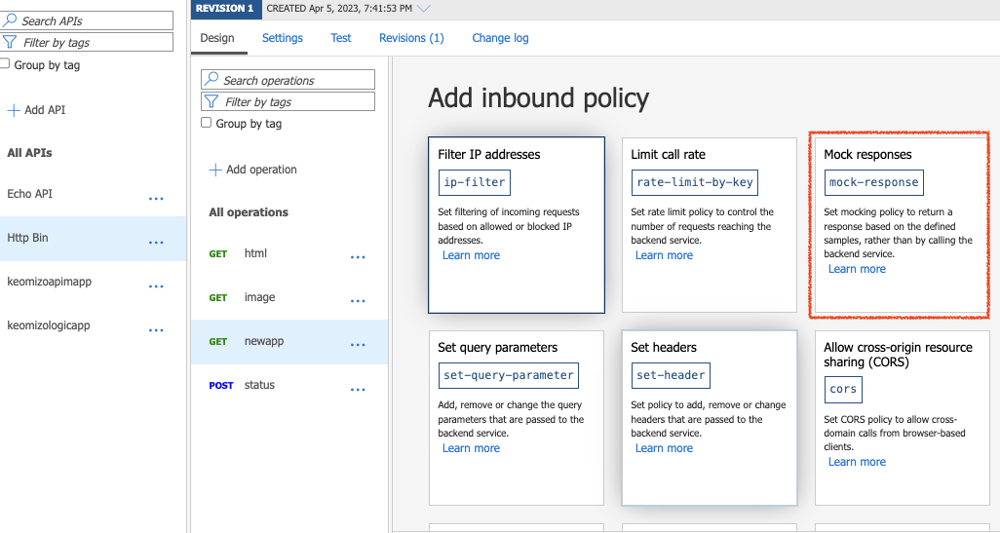

#### 2-5. API Management responseを確認して、画面下部の「Save」ボタンをクリック
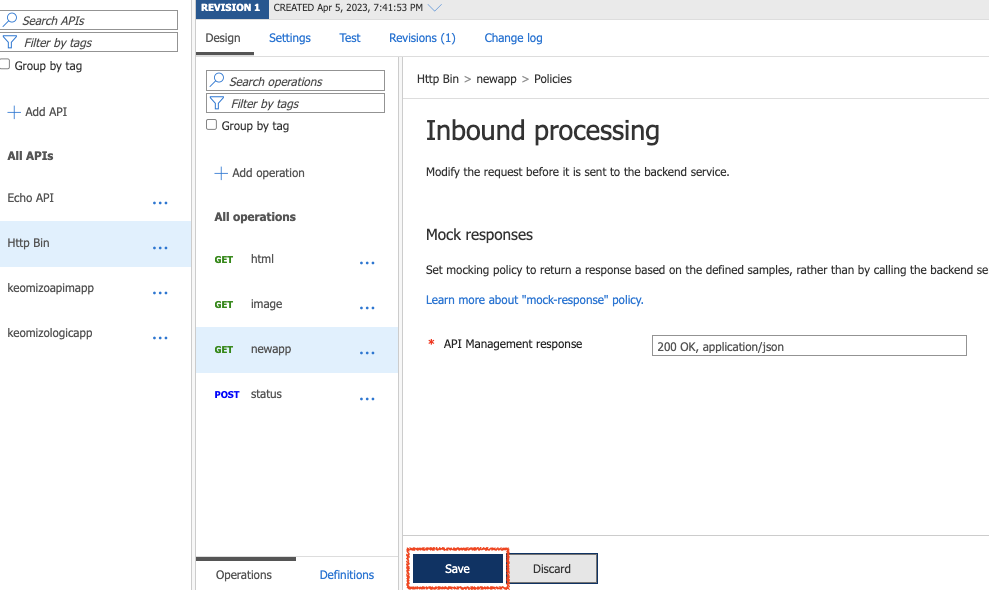


#### 2-6. レスポンスを編集する場合は、Frontendの編集アイコンをクリックしてフロントエンドのエディタを開く
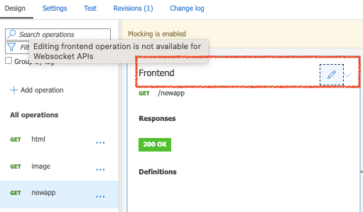


---

<a href="api-policy.md">←戻る</a>
<a href="readme.md">↑メニュー</a>
→ 次へ