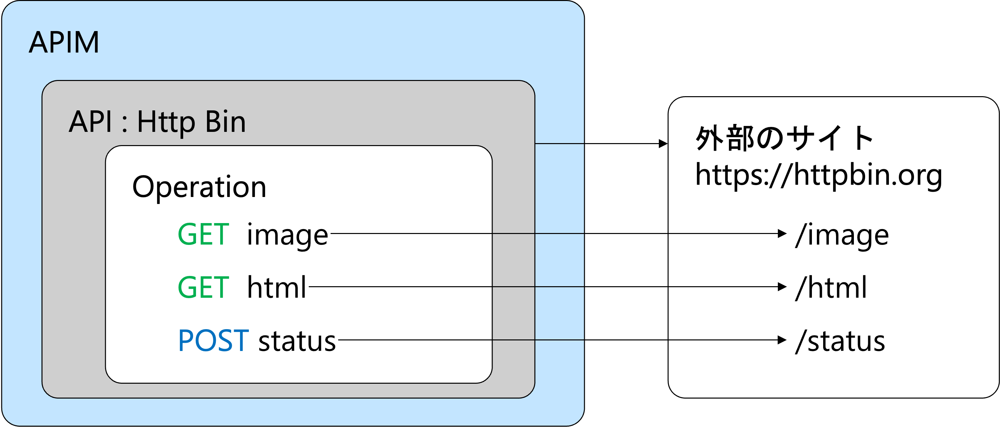
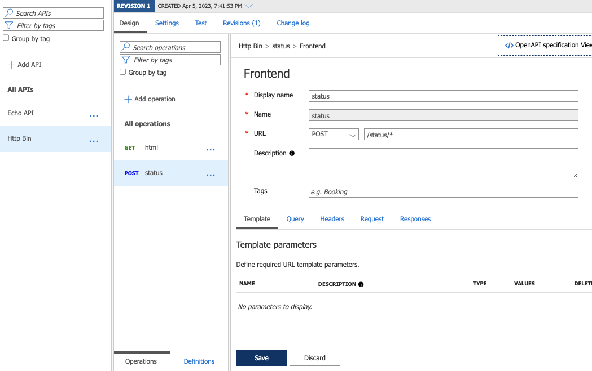
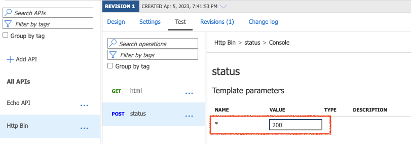
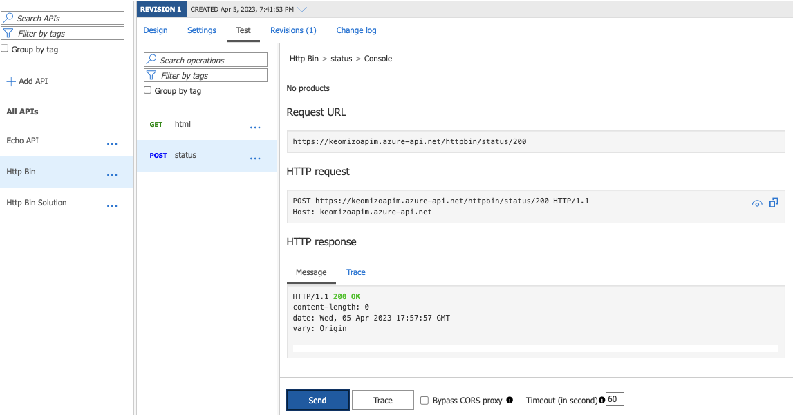
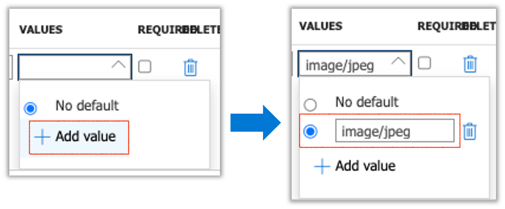
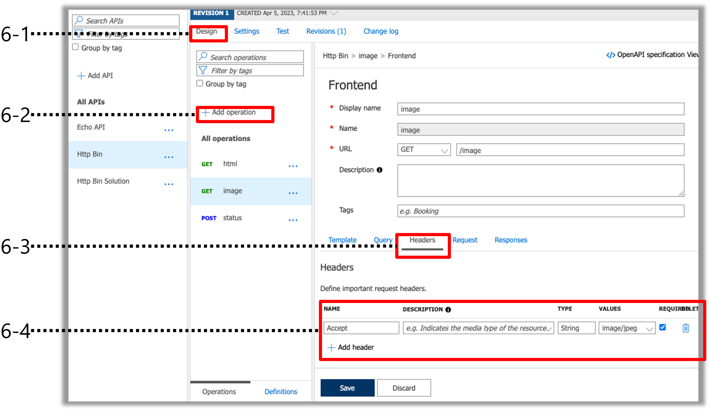
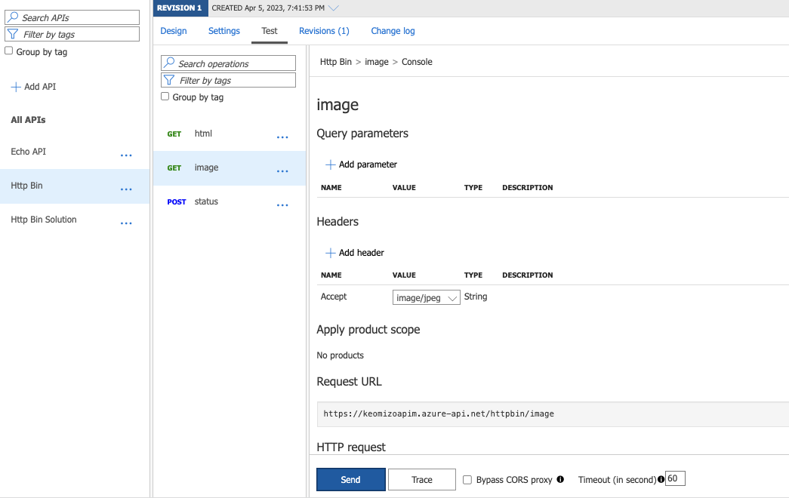
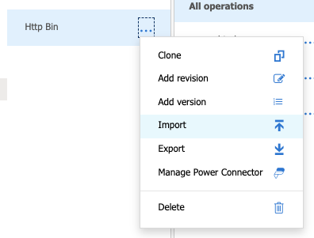
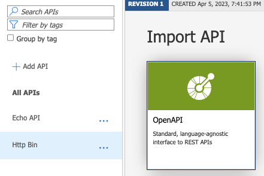
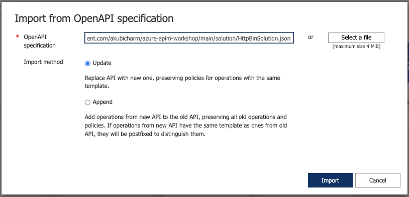

# 外部サイトとの連携

API Managementを通して外部のサイトを呼び出すための設定をしていきます。
ここでは外部アプリケーションとして[httpbin.org](https://httpbin.org)の3つのAPIを呼ぶ設定をしていきます。

外部サイトの連携でやることは次のとおりです。

1. APIを追加
2. Operationの定義 その１ シンプルなGET
3. GETの呼び出しのテスト
4. Operationの定義 その2 シンプルなPOST
5. POSTの呼び出しテスト
6. Operationの定義　その3 ヘッダーを追加して GET 
7. コンテキストパスを設定した GETの呼び出しテスト

### 1. APIを追加

#### 1-1. API Managementサービスのポータル画面の右Paneで「API」をクリック
#### 1-2. API Managementサービスのポータル画面の左Paneの Define a new API で「HTTP」をクリック

#### 1-3. Create an HTTP APIのダイアログで呼び出すAPIを設定

|名称|値|
|---|---|
|入力モード|Basic|
|Display Name|Http Bin|
|Name|自動入力されるのでそのまま|
|Web service URL|https://httpbin.org|
|API URL Suffix|httpbin|
|Base URL|「API URL Suffix」の指定に従って、自動入力|

ダイアログの右下の「Create」をクリック

#### 1-4. API Managementサービスのポータル画面の右Paneの上部の「Settings」タブをクリック
#### 1-5. Subscriptionを不要に設定

誰でもこのAPIが呼び出せるようにSubscriptionのチェックボックスのチェックを外して、画面下部の「Save」をクリック

### 2. Operationの定義 その１ - シンプルなGET
#### 2-1. 画面上部の「Design」タブをクリックしてデザイン画面を表示
#### 2-2. 「+Add operation」をクリックしてOperationの詳細を入力
|名称|値|
|---|---|
|Display name|html|
|Name|自動入力されるのでそのまま|
|URL|メソッド: GET、コンテキストパス: /html|

画面下部の「Save」ボタンをクリック

### 3. GETの呼び出しテスト

#### 3-1. 画面上部の「Test」タブをクリックしてテスト画面を表示
#### 3-2. Operationの一覧から先ほど追加した 「GET html」を選択
#### 3-3. 画面下部の「Send」ボタンをクリック

レスポンスヘッダーが「200 OK」ならば接続完了

右Paneをスクロールして __Request URL__ をコピーしてブラウザからもアクセスしてみる。

### 4. Operationの定義 その2 - シンプルなPOST

#### 4-1. 画面上部の「Design」タブをクリックしてデザイン画面を表示
#### 4-2. 「+Add operation」をクリックしてOperationの詳細を入力
|名称|値|
|---|---|
|Display name|status|
|Name|自動入力されるのでそのまま|
|URL|メソッド: POST、コンテキストパス: /status/*|

画面下部の「Save」ボタンをクリック

### 5. POSTの呼び出しテスト

#### 5-1. 画面上部の「Test」タブをクリックしてテスト画面を表示
#### 5-2. Operationの一覧から先ほど追加した 「POST status」を選択
#### 5-3. Template Parameterに「200」を入力し、画面下部の「Send」ボタンをクリック

レスポンスヘッダーが「200 OK」ならば接続完了

#### 5-4. Template Parameterに「500」を入力し、画面下部の「Send」ボタンをクリック
500 INTERNAL SERVER ERROR が返ってくることを確認する。

### 6. Operationの定義　その3 ヘッダーを追加して GET 
#### 6-1. 画面上部の「Design」タブをクリックしてデザイン画面を表示
#### 6-2. 「+Add operation」をクリックしてOperationの詳細を入力
|名称|値|
|---|---|
|Display name|image|
|Name|自動入力されるのでそのまま|
|URL|メソッド: GET、コンテキストパス: /image|

#### 6-3. 画面をスクロールしHeadersタブをクリック

#### 6-4. Headersセクションで「+ Add Header」をクリックして、HTTPヘッダを設定

|名称|値|
|---|---|
|NAME|Accept|
|DESCRIPTION|（空白）|
|TYPE|String|
|VALUES|image/jpeg プルダウンを表示し、「+ Add Value」をクリックして入力 |
|REQUIRED|チェックする|

画面下部の「Save」ボタンをクリック

### 7. GETの呼び出しテスト

#### 7-1. 画面上部の「Test」タブをクリックしてテスト画面を表示
#### 7-2. Operationの一覧から先ほど追加した 「GET image」を選択
#### 7-3. 画面下部の「Send」ボタンをクリック

右Paneをスクロールして __Request URL__ をコピーしてブラウザからもアクセスしてみる。

## 裏技：ソリューションを使ってOperationを追加する

#### 1. API一覧の Http Binの右の「・・・」をクリックしてプルダウンメニューを表示し、「Import」をクリック

#### 2. Import APIの一覧から「Open API」をクリック

#### 3. インポートするファイルを指定してインポート

|名称|値|
|---|---|
|OpenAPI specification|https://raw.githubusercontent.com/akubicharm/azure-apim-workshop/main/solution/HttpBinSolution.json|
|Import method|Update|

---

<a href="setup-apim.md">←戻る</a>
<a href="readme.md">↑メニュー</a>
<a href="api-function.md">次へ→</a>