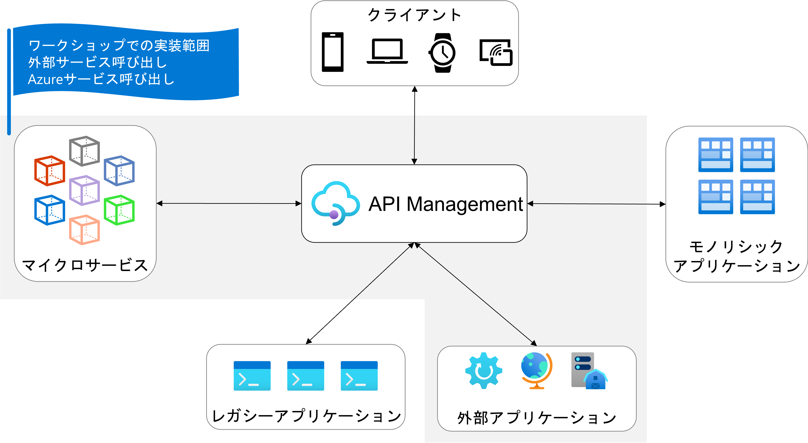
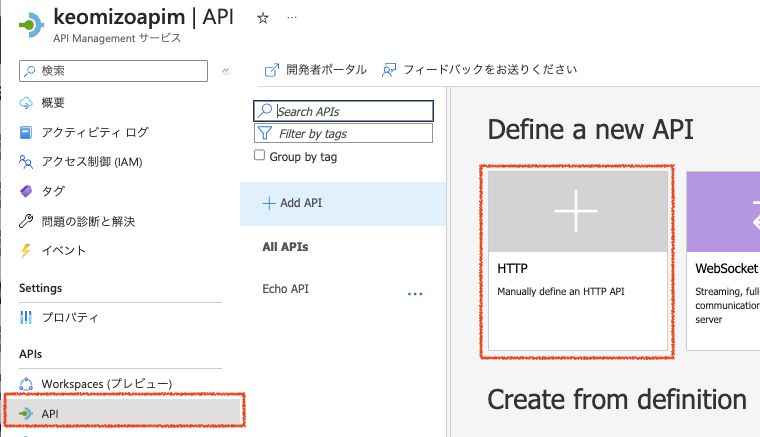
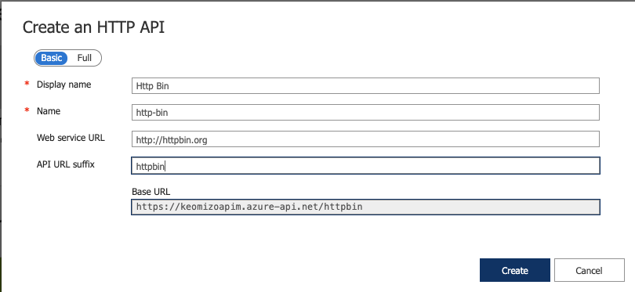
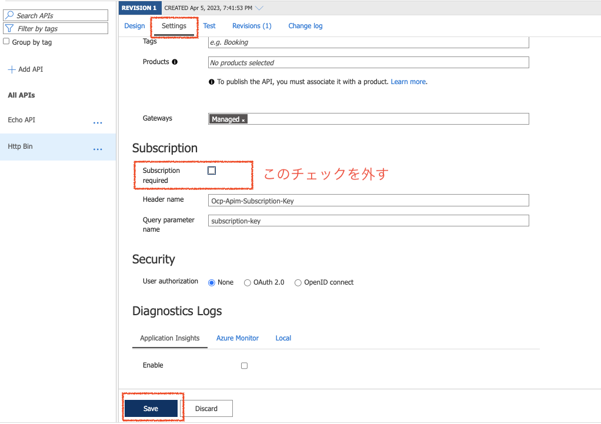
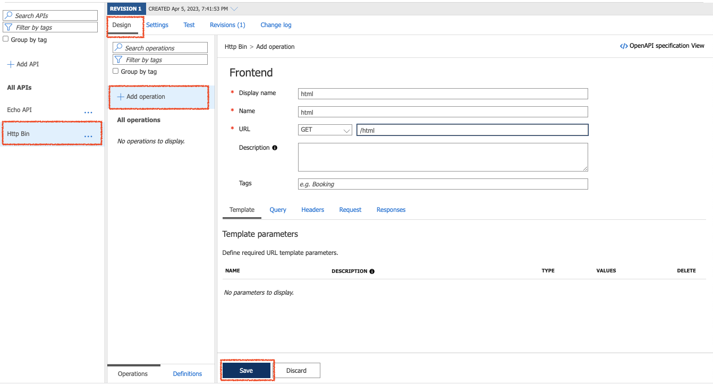
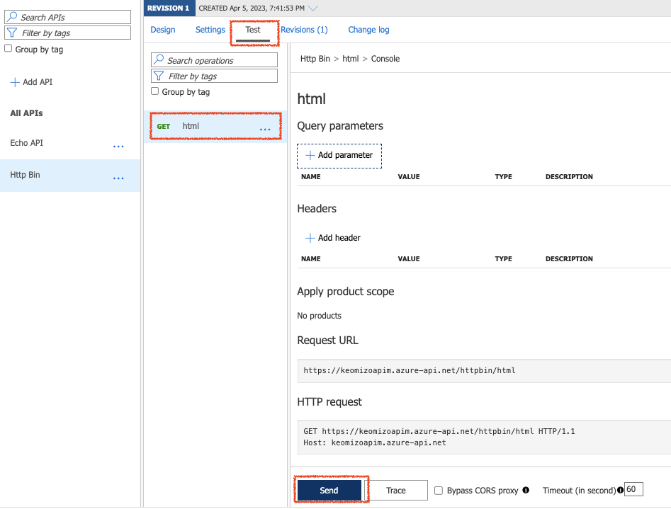
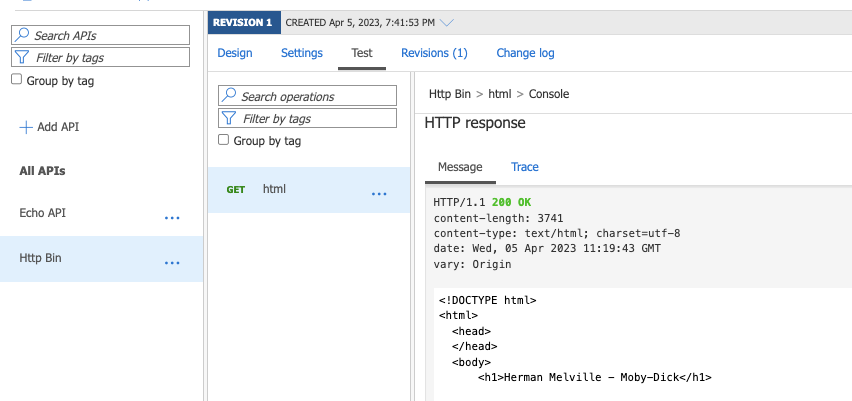
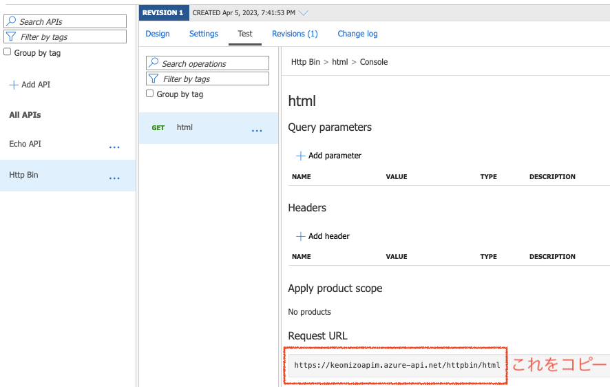

# シンプルなAPI連携

ここでは、3種類のAPI連携をやっていきます。

1. 外部のサイトと連携
2. Azure Functionsとの連携
3. Azure Logic Apps との連携

## 外部のサイトとの連携

まずは、API Managementを通して外部のサイトを呼び出すための設定をしていきます。

外部サイト: https://httpbin.org

|メソッド|コンテキストパス|
|---|---|
|GET|/html|
|POST|/status|
|GET|/image|

外部サイトの連携でやることは次のとおりです。

1. APIを追加
2. Operationの定義 その１ シンプルなGET
3. GETの呼び出しのテスト
4. Operationの定義 その2 シンプルなPOST
5. POSTの呼び出しテスト
6. Operationの定義　その3 ヘッダーを追加して GET 

### 1. APIを追加

#### 1-1. API Managementサービスのポータル画面の右Paneで「API」をクリック
#### 1-2. API Managementサービスのポータル画面の左Paneの Define a new API で「HTTP」をクリック

#### 1-3. Create an HTTP APIのダイアログで呼び出すAPIを設定

|名称|値|
|---|---|
|入力モード|Basic|
|Display Name|Http Bin|
|Name|自動入力されるのでそのまま|
|Web service URL|https://httpbin.org|
|API URL Suffix|httpbin|
|Base URL|「API URL Suffix」の指定に従って、自動入力|

ダイアログの右下の「Create」をクリック

#### 1-4. API Managementサービスのポータル画面の右Paneの上部の「Settings」タブをクリック
#### 1-5. Subscriptionを不要に設定

誰でもこのAPIが呼び出せるようにSubscriptionのチェックボックスのチェックを外して、画面下部の「Save」をクリック

### 2. Operationの定義 その１ - シンプルなGET
#### 2-1. 画面上部の「Design」タブをクリックしてデザイン画面を表示
#### 2-2. Operationの詳細を入力
|名称|値|
|---|---|
|Display name|html|
|Name|自動入力されるのでそのまま|
|URL|メソッド: GET、コンテキストパス: /html|

画面下部の「Save」ボタンをクリック

### 3. GETの呼び出しテスト

#### 3-1. 画面上部の「Test」タブをクリックしてテスト画面を表示
#### 3-2. Operationの一覧から先ほど追加した 「GET html」を選択
#### 3-3. 画面下部の「Send」ボタンをクリック

レスポンスヘッダーが「200 OK」ならば接続完了

右Paneをスクロールして __Request URL__ をコピーしてブラウザからもアクセスしてみる。

