# サブスクリプションを利用したAPIアクセスの保護

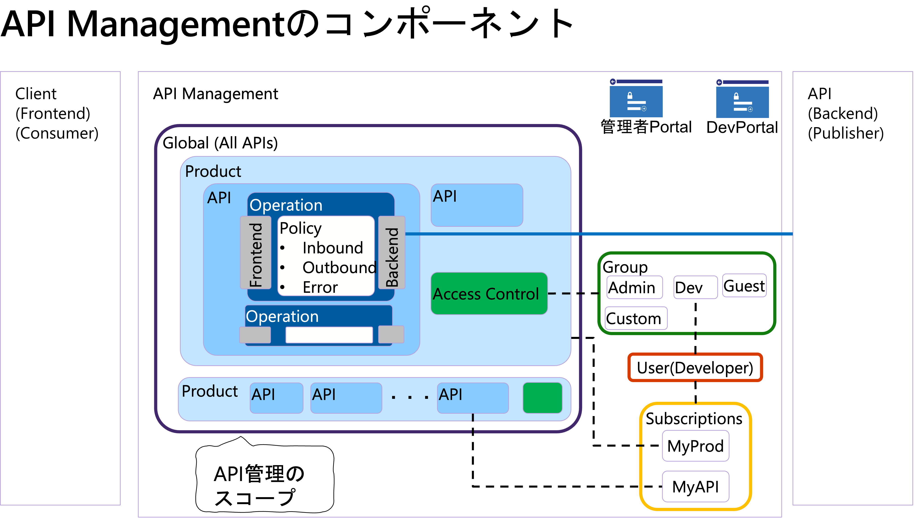


## サブスクリプション、製品、APIの関係

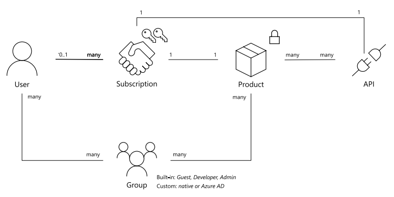

* サブスクリプション<br>
APIまたはProducts(製品)に対してAPIキーによるアクセス制御を実現するための仕組みで、フロントエンドの呼び出し時にリクエストヘッダーはクエリパラメータにキーを設定。API, Productsごとにキーの必須/非必須が設定可能。

* Products (製品)<br>
1つまたは複数のAPIをまとめる論理的な単位。

## 既定のサブスクリプション、製品を確認

### 1. 既定のサブスクリプションと製品の確認

#### 1-1. API Managementの管理ポータルの左Paneで「サブスクリプション」をクリック
スコープのカラムで「製品:Starter」「製品:Unlimited」のSubscriptionがあることを確認します。


#### 1-2. API Managementの管理ポータルの左Paneで「製品」をクリックし、右Paneの一覧から「Starter」をクリック

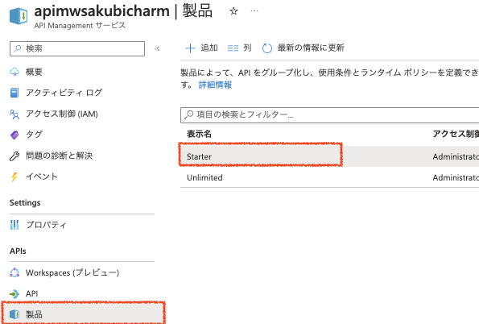

#### 1-3. Starterのポリシーを確認

左Paneで「ポリシー」をクリックし、表示されたポリシー設定のInbound processingの「</>」をクリックして詳細を確認します。

このポリシーでは60秒に5回呼び出し可能、604800(1週間)で100回呼び出せることが定義されています。Starter製品に関連づけられたSubscriptionを利用してAPIをコールするユーザには、このポリシーが適用されます。

```
<policies>
    <inbound>
        <rate-limit calls="5" renewal-period="60" />
        <quota calls="100" renewal-period="604800" />
        <base />
    </inbound>
    <backend>
        <base />
    </backend>
    <outbound>
        <base />
    </outbound>
    <on-error>
        <base />
    </on-error>
</policies>
```

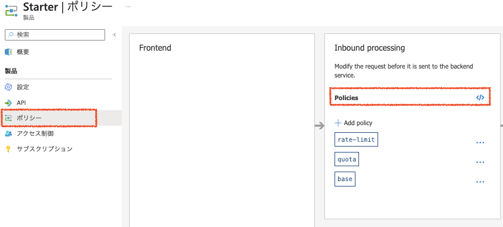

Unlimitedは、ポリシーでの制限がかかっていません。


### 2. Productのポリシー適用の確認

#### 2-1. Echo APIのSubscriptionが有効になっていることを確認

#### 2-2.　製品のポリシーのテスト

API一覧から「Echo API」を選択し、右Pane上部の「Test」タブを選択します。表示されたOperation一覧から「GET Retrieve resource」を選択します。

右Paneの真ん中あたりのApply product scopeセクションのProduct一覧のプルダウンで「Starter」を選択し、画面下部の「Send」を6回連打します。

6回目の呼び出し後に呼び出し回数が超過したエラーメッセージが表示されます。

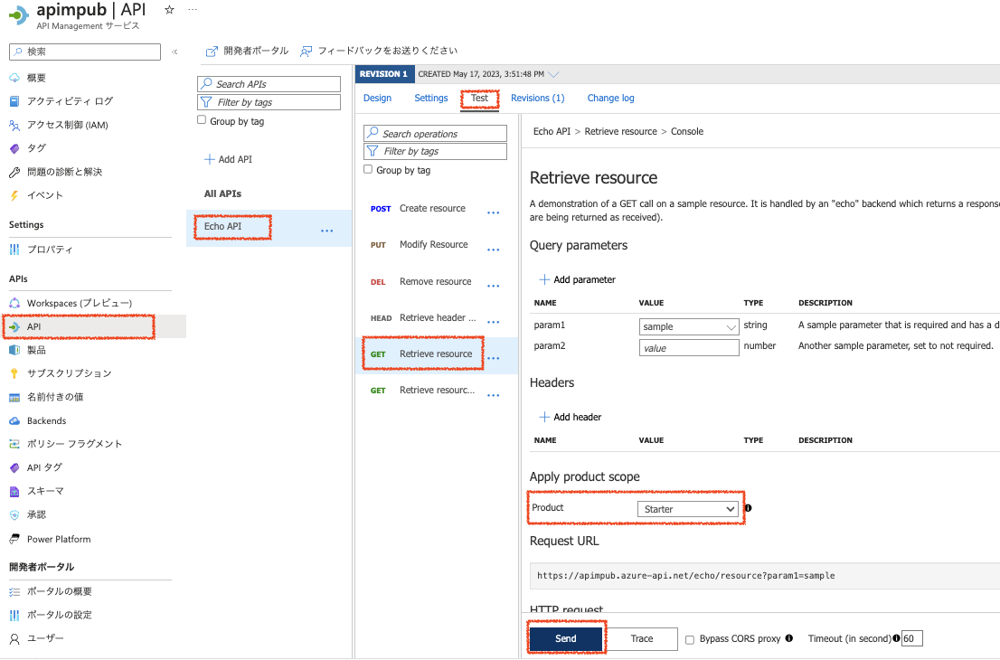


### 3. Subscriptionキーを利用したアクセス

サブスクリプションキーを利用したアクセスをする場合には、クエリパラメータまたはHttpヘッダーにキーを設定します。

クエリパラメータに設定する場合は`subscription-key`、HTTPヘッダーに設定する場合は`Ocp-Apim-Subscription-Key`です。

APIのSettingsタブで確認することができます。

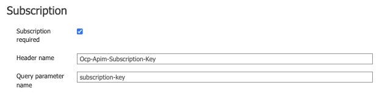


#### 3-1. StarterポリシーのSubscriptionキーを確認

API　Managementの管理画面の右Paneで「サブスクリプション」をクリックして、Subscriptionの一覧を表示します。

表示された一覧の１行目（スコープが　製品:starterとなっている行）の右端の「…」をクリックしてプルダウンメニューを表示し「キーの表示/非表示」をクリックします。

主キーのカラムのコピーアイコンをクリックしてキーをコピーし、メモ帳などの貼り付けておきます。

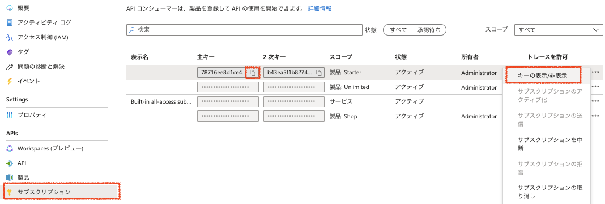

#### 3-2. Echo APIの「GET Retrieve resouce」のRequest URLを確認
API一覧から「Echo API」を選択し、右Pane上部の「Test」タブを選択します。表示されたOperation一覧から「GET Retrieve resource」を選択しRequest URLを確認します。

Request URLの例）`https://myapim.azure-api.net/echo/resource?param1=sample`


#### 3-3. ブラウザから　APIを呼ぶ

クエリパラメータにサブスクリプションキーを指定して呼びます。

```
https://[APIMのFQDN]/echo/resource?param1=sample&subscription-key=[コピーしておいたSubscriptionkey]
```

subscription-keyをクエリパラメータに指定しなかった場合は、次のようなエラーメッセージが帰ってきます。

```
{ "statusCode": 401, "message": "Access denied due to missing subscription key. Make sure to include subscription key when making requests to an API." }
```


## APIの追加

次の図のような構成になるように、新たなAPIを追加します。

- 販売店は複数の API を製品として束ねることで、単一のサブスクリプションで利用できるようにする
- 製造者は１つの 受発注 API のみを利用できれば良いので、製品を作成せずに API レベルのサブスクリプションを利用する
- 匿名の顧客は顧客商品 API のみを、サブスクリプションキーなしで呼び出せる

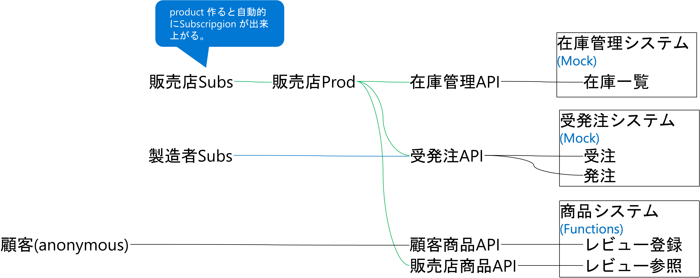

### 4. 在庫管理APIのインポート

#### 4-1. OpenAPI をインポート

APIMの管理ポータルの左Paneで「API」を選択し、「+ Add APIをクリック」し、右PaneのOpenAPIをクリックします。

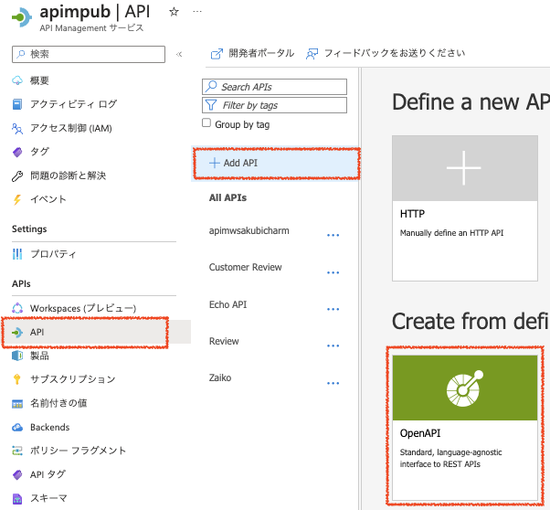

「Create from Definition」のダイアログに必要な項目を入力し、「Create」ボタンをクリックしてAPIをインポートします。

|名称|値|
|---|---|
|OpenAPI Specification|`https://raw.githubusercontent.com/akubicharm/azure-apim-workshop/main/solution/Zaiko.openapi.json`|
|Display name|Zaiko|
|Name|zaiko|
|API URL Suffix|zaiko|

#### 4-2. Mockレスポンスの設定

追加した　Zaiko APIのOperation一覧で「All operations」をクリックし、Inbound Processing のセクションで「+Add policy」をクリックします。

※ All Operationsでポリシーを設定すると、Order API全体にポリシーが適用されます。


ポリシーの一覧でMock Responsesを選択肢、編集画面の内容は変更せずに「Save」ボタンをクリックしてポリシーを保存します。

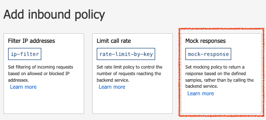


### 5. 受発注APIのインポート

#### 5-1. OpenAPIをインポート

APIMの管理ポータルの左Paneで「API」を選択し、「+ Add APIをクリック」し、右PaneのOpenAPIをクリックします。


「Create from Definition」のダイアログに必要な項目を入力し、「Create」ボタンをクリックしてAPIをインポートします。

|名称|値|
|---|---|
|OpenAPI Specification|`https://raw.githubusercontent.com/akubicharm/azure-apim-workshop/main/solution/Order.openapi.json`|
|Display name|Order|
|Name|order|
|API URL Suffix|order|

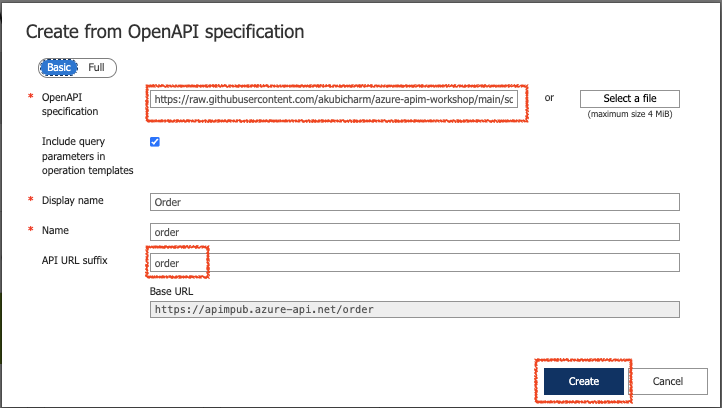


#### 5-2. Mockレスポンスの設定

追加した　Order APIのOperation一覧で「All operations」をクリックし、Inbound Processing のセクションで「+Add policy」をクリックします。


ポリシーの一覧でMock Responsesを選択肢、編集画面の内容は変更せずに「Save」ボタンをクリックしてポリシーを保存します。


### 6. 商品システムAPIのFunctionのデプロイ

<a href="api-function.md">Azure Functionとの連携</a>でデプロイしたFunctionsを更新します。

#### 6-1. デプロイ済みのFunctionの管理画面を開く

#### 6-2. 左Paneで「デプロイセンター」をクリック

#### 6-3. 右Pane上部の「同期」をクリック

#### 6-4. 関数の確認

createReview、listReviewsという関数が追加されていることを確認します。

## 商品システムAPIの登録
顧客用と販売店ように2つのAPIとして登録します。

### 7. 顧客用商品システムAPIの登録

#### 7-1. APIMの管理画面の左Paneで「API」を選択して、「+ Add API」をクリック
#### 7-2. 右PaneのCreate from Azure resouceセクションで「Function App」をクリック


#### 7-3. createReviewだけを選択してインポート


|名称|値|
|---|---|
|Funcion App|選択したFunctionの名前|
|Display Name|custReview|
|Name|custreview(自動入力)|
|API URL suffix|custreview|
|Base URL|自動入力|

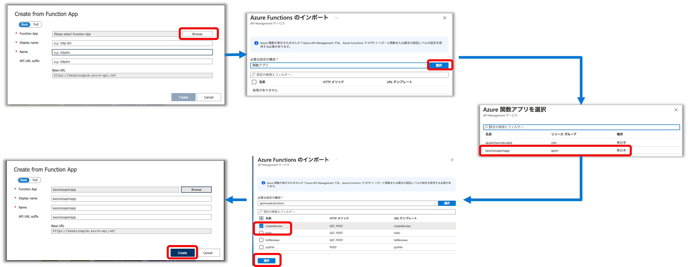

### 8. 販売店用商品システムAPIの登録

顧客用商品システムAPIの登録と同様の手順で販売店用商品システムAPIを登録します。

#### 8-1. APIMの管理画面の左Paneで「API」を選択して、「+ Add API」をクリック
#### 8-2. 右PaneのCreate from Azure resouceセクションで「Function App」をクリック
#### 8-3. createReviewとlistReviewsを選択してインポート

|名称|値|
|---|---|
|Funcion App|選択したFunctionの名前|
|Display Name|Review|
|Name|review(自動入力)|
|API URL suffix|review|
|Base URL|自動入力|


## 製品、サブスクリプションの登録

### 9. 販売店用の製品の登録

#### 9-1. APIM管理画面の左Paneの「製品」をクリックし、右Pane上部の「+追加　」をクリック
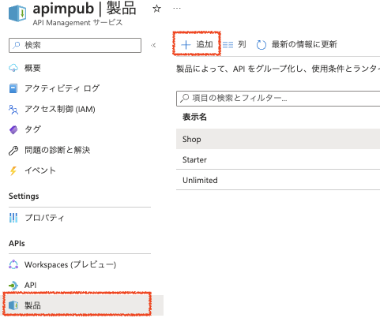

#### 9-2. パラメータを入力して製品を作成

次のパラメータを入力して、「作成」ボタンをクリックします。

|名称|値|
|---|---|
|表示名|Shop|
|ID|shop(自動入力)|
|説明|販売店用|
|発行済み|チェックする|
|サブスクリプションを要求する|チェックする|
|承認が必要|チェックせず|
|サブスクリプション数の制限|空白|
|法律条件|空白|
|API|「+」をクリックして `Order`、`Review`、`Zaiko` を追加|


#### 9-3. 作成した製品のサブスクリプションを確認
作成したサブスクリプションを選択し、サブスクリプションを確認します。
API キーを表示してメモ帳等に控えておいてください。

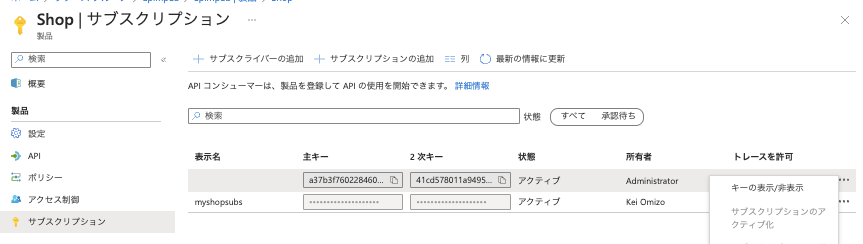

#### 9-4. 製品のSubscriptionを利用してAPIを呼ぶ

Zaiko APIのgetListオペレーションのテストタブを開き、リクエストURLを確認します。
確認したURL `https://[APIMのURL]/zaiko/list` もメモ帳等に控えておきます。

コマンドラインからテストする場合は以下のようになります。

```powershell
# PowerShell core の場合
$url = '[控えておいたリクエストURL]'
$header = @{'Ocp-Apim-Subscription-Key' = '[控えておいた API キー]'}
Invoke-WebRequest -Uri $url -Headers $header
```

```bash
# Bash の場合
url=[控えておいたリクエストURL]
header='Ocp-Apim-Subscription-Key: [控えておいたAPIキー]'
curl -H "$header" $url
```

```cmd
: Windows コマンドプロンプトの場合
SET URL=https://apim-ainaba1016.azure-api.net/zaiko/list
SET HEADER=Ocp-Apim-Subscription-Key: [控えておいたAPIキー]
curl -H "%HEADER%" %URL%
```


Postman でテストする場合は以下の画面を参考にしてください。

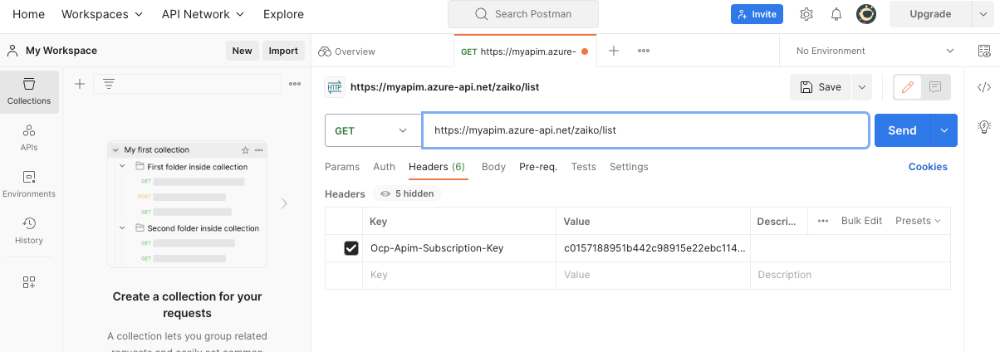

### 10. 製造社用のサブスクリプションの登録

#### 10-1. APIM管理画面の左Paneで「サブスクリプション」をクリックし、右Pane上部の「+サブスクリプションの追加」をクリック

#### 10-2. パラメータを入力してサブスクリプションを作成

次の値を入力して「作成」ボタンをクリックします。

|名称|値|
|---|---|
|名前|Maker|
|表示名|Maker|
|スコープ|API|
|API|Order|
|ユーザ|Administrator|

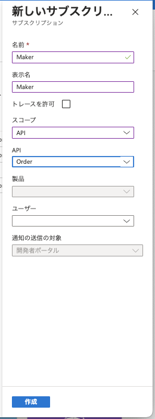


### 11. 顧客レビューのサブスクリプションを不要に設定

#### 11-1. APIM管理画面の左Paneで「API」をクリックし、「custReview」のAPIを選択

#### 11-2. サブスクリプション不要に設定

右Pane上部の「Settings」タブをクリックし、画面の中央あたりのSubscriptionセクションの「Subscription required」のチェックをはずします。

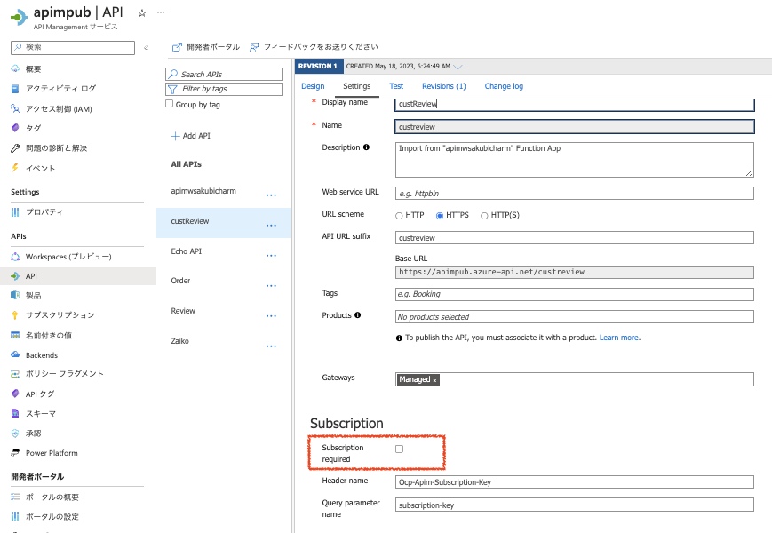

