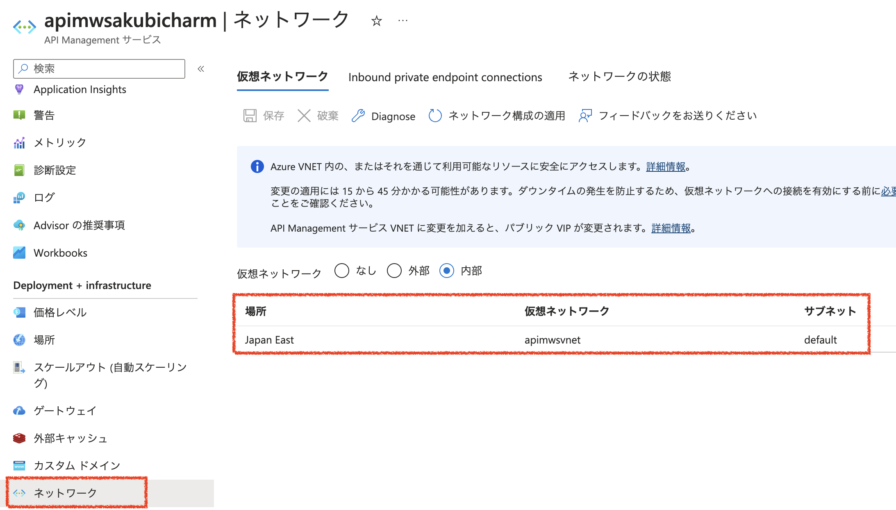
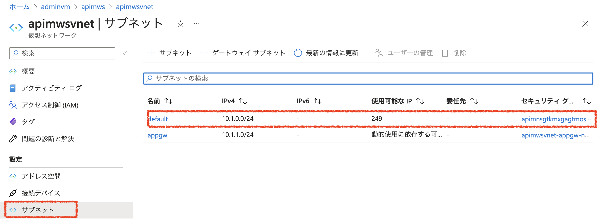
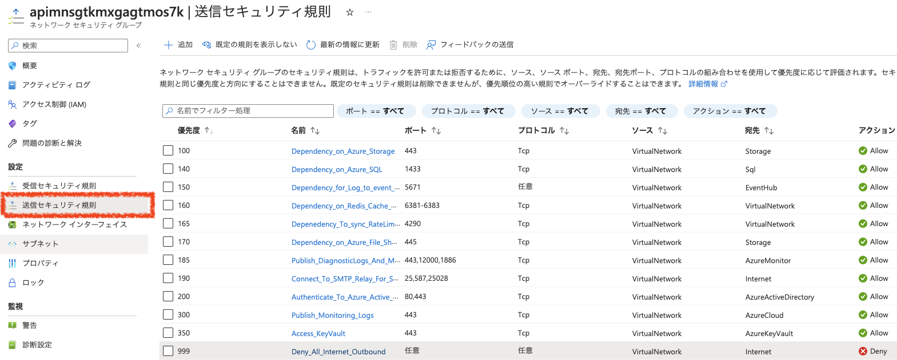
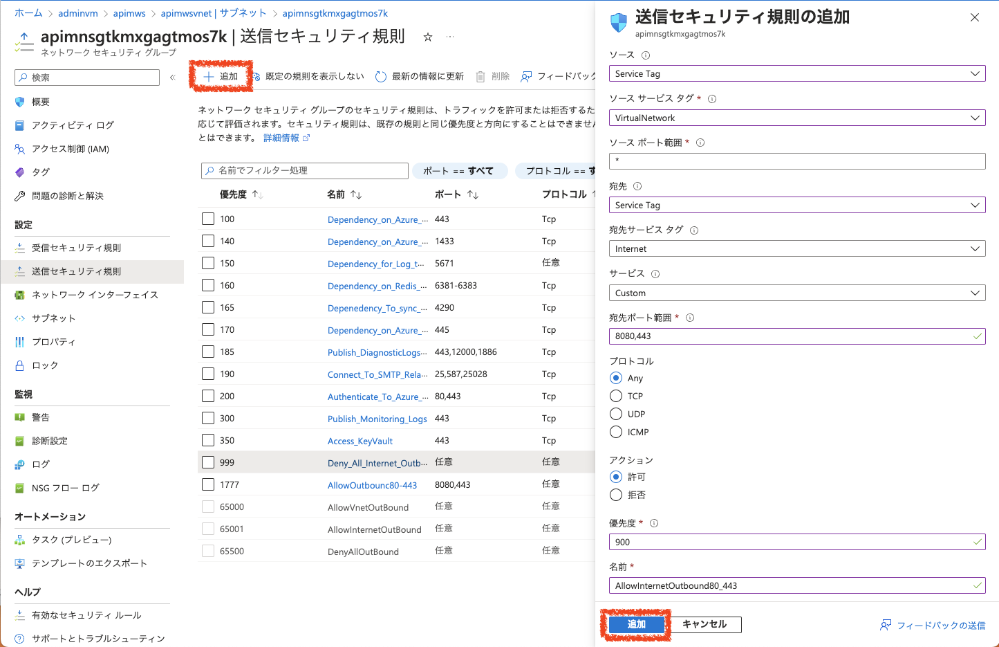

# 内部仮想ネットワークを利用するAzure API Managementのデプロイ

内部仮想ネットワークを利用するAzure API Managementのデプロイでやることは以下の通りです。

1. パブリックIPアドレスの作成
2. Azure API Managementのデプロイ

補足
X. Outboundのインターネットへの通信の許可

## 1. パブリックIPアドレスの作成

### 1.1 AzureポータルでパブリックIPアドレスの作成を開始

Azureポータル画面でリソースグループを選択し、右Pane上部の「+作成」ボタンをクリックします。

### 1.2 マーケットプレイスの検索フィールドに「パブリックIP」と入力し、一覧から「パブリックIPアドレス」を選択

### 1.3 「作成」ボタンをクリック

### 1.4 パラメータを入力してパブリックIPアドレスを作成

|名称|値|
|---|---|
|名前|apimpip|
|IPバージョン|IPv4|
|SKU|Standard|
|可用性ゾーン|Zone-redundant|
|レベル|Regional|
|IPアドレスの割り当て|静的|
|ルーティングの優先順位|Microsoftネットワーク|
|アイドルタイムアウト|4 (デフォルト値のまま)|
|DNS名ラベル|一意になる名称|

上記パラメータを入力して画面下部の「作成と確認」ボタンをクリックします。

確認が終了したら、画面下部の「作成」ボタンをクリックします。

## 2. Azure API Managementのデプロイ

### 2.1 Azureポータルで仮想ネットワークの作成を開始
リソースグループの画面に戻り、右Pane上部の「+作成」ボタンをクリックします。

### 2.2 マーケットプレイスの検索フィールドに「api management」と入力し、一覧から「API Management」をクリック

### 2.3 基本タブ

__プロジェクトの詳細__
|名称|値|
|---|---|
|サブスクリプション| ハンズオンで利用するサブスクリプションを選択|
|リソースグループ|ハンズオンで利用するリソースグループを選択。新規作成する場合は、「新規作成」をクリックしてリソースグループを入力   |

__インスタンスの詳細__
|名称|値|
|---|---|
|リージョン|ハンズオンで利用するリージョンを選択。例）東日本|
|リソース名|APIMのリソース名を入力。このリソース名がドメイン名の元になるので、Azure上で一意となる名称。 例)apimws20230401、mynameapimws ドメイン名の例）apimws20230401.azure-api.net|
|Organization Name|開発者ポータルのタイトルや通知メールに使われるので、わかりやすい名前をつける。Azureで一意である必要はない。|
|管理者のメールアドレス|APIMからの通知が送信されるメールアドレス。ワークショップ参加者の受信可能なメールアドレスを設定。|
|**価格レベル**||
|価格レベル|Developer（SLAなし）を選択|

必要な項目を入力したら、*監視、スケーリング、マネージドIDの設定は飛ばして* 「仮想ネットワーク」タブをクリック

### 2.4 仮想ネットワークタブで内部を選択し、仮想ネットワークを作成

接続の種類で「内部」を選択し、下部に表示された仮想ネットワーク構成の仮想ネットワークプルダウンの「新規作成」のリンクをクリックして、仮想ネットワーク設定のダイアログを表示。

|名称|値|
|---|---|
|名前|apimvnet|
|アドレス空間|デフォルトのまま|
|サブネット|デフォルトのまま|

ダイアログ下部の「OK」ボタンをクリックします

### 2.5 仮想ネットワークタブでパブリックIPアドレスを指定

|名称|値|
|---|---|
|__ネットワーク接続__|
|接続の種類|仮想ネットワーク|
|__仮想ネットワーク__|
|種類|内部|
|__仮想ネットワークの構成__|
|仮想ネットワーク|apimvnet（ダイアログで作成した仮想ネットワーク）|
|サブネット|default|
|パブリックIPアドレス|apimvnet (前の手順で作成したパブリックIPをプルダウンメニューから選択)|

*プロトコル設定、タグの設定は飛ばして*　「確認とインストール」タブをクリック

### 2.6. 確認とインストールタブ
入力内容のチェックが終わると、画面下部の「作成」ボタンが有効になるので「作成」ボタンをクリックしてAPIMの作成を開始

## 補足. Outboundのインターネットへの通信の許可

サブネットに関連づけられたNetwork Security Group(NSG)でインターネットへの通信が拒否設定になっているので、バックエンドのAPIへのアクセスはインターネット経由ではできません。
バックエンドのAPIにインターネット経由でアクセスするための設定をしていきます。

### X.1. APIMが接続されている仮想ネットワークの確認

API Managementの管理画面の左paneでネットワークをクリックし、接続している仮想ネットワークとサブネットを確認します。

### X.2. ネットワークセキュリティグループの確認

Azureの管理画面でAPIMが接続されている仮想ネットワークを選択し、左Paneのサブネットをクリックします。

ネットワークセキュリティグループのリンクをクリックし、ネットワークセキュリティグループの管理画面を表示します。

### X.3. ネットワークセキュリティグループの管理画面を表示

ネットワークセキュリティグループの管理画面の左Paneで「送信セキュリティ規則」をクリックして、送信セキュリティ規則の一覧を表示します。

### X.4. 送信セキュリティ規則の確認

優先度 999の「Deny_All_Internet_Outbound」の規則によって、インターネットへの通信が拒否されています。
ネットワークセキュリティグループの規則は、優先度が高い（数字が小さい）方から評価されるので999よりも高い優先度で、80, 443ポートへのインターネットへの通信を許可するルールを追加することで、インターネット経由でのバックエンドのAPIのHTTP(S)での可能になります。

※ここでは、宛先IPアドレスの指定はしませんが、宛先IPアドレスを指定することで特定のサイトのみへの通信が許可できます。

### X.5. 送信規則の追加

画面上部の「＋追加」をリリックして、送信セキュリティ規則の追加を開始します。

以下のパラメータを入力し、「追加」ボタンをクリックします。|

|名称|値|
|---|---|
|ソース|Service Tag|
|ソースサービスタグ|VirtualNetwork|
|ソースポート範囲|* (デフォルトのまま)|
|宛先|Service Tag|
|宛先サービスタグ|Internet|
|サービス|Custom   HTTP または HTTPS のみの場合はHTTPやHTTPSが選択可能|
|宛先ポート範囲|80,443|
|プロトコル|TCP|
|アクション|許可|
|優先度|900|
|名前|AllowInternetOutbound80_443 など規則がわかりやすい名称|

---
<a href="readme.md">↑メニュー</a>
<a href="setup-appgw.md">次へ→</a>