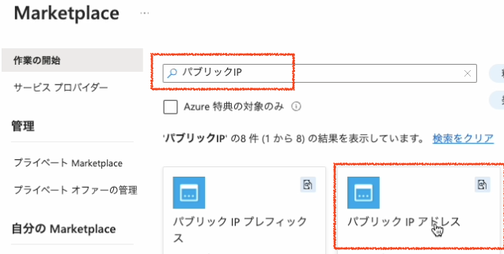
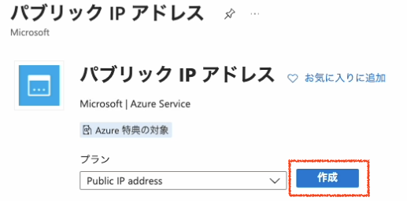
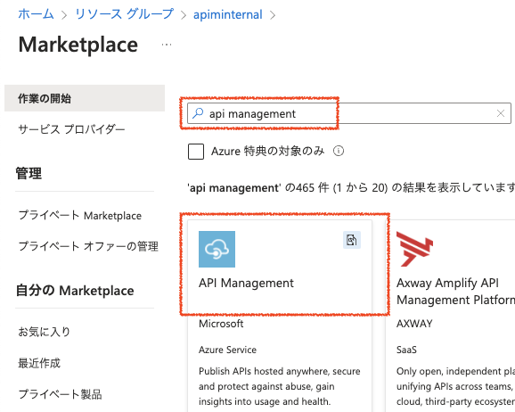
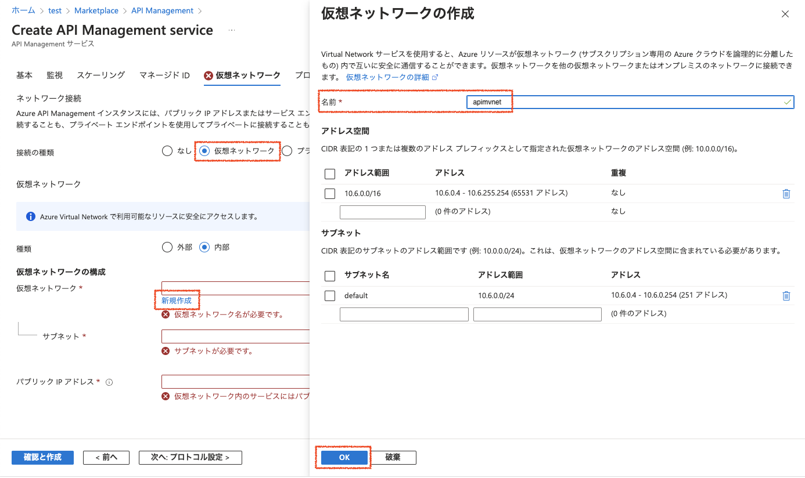
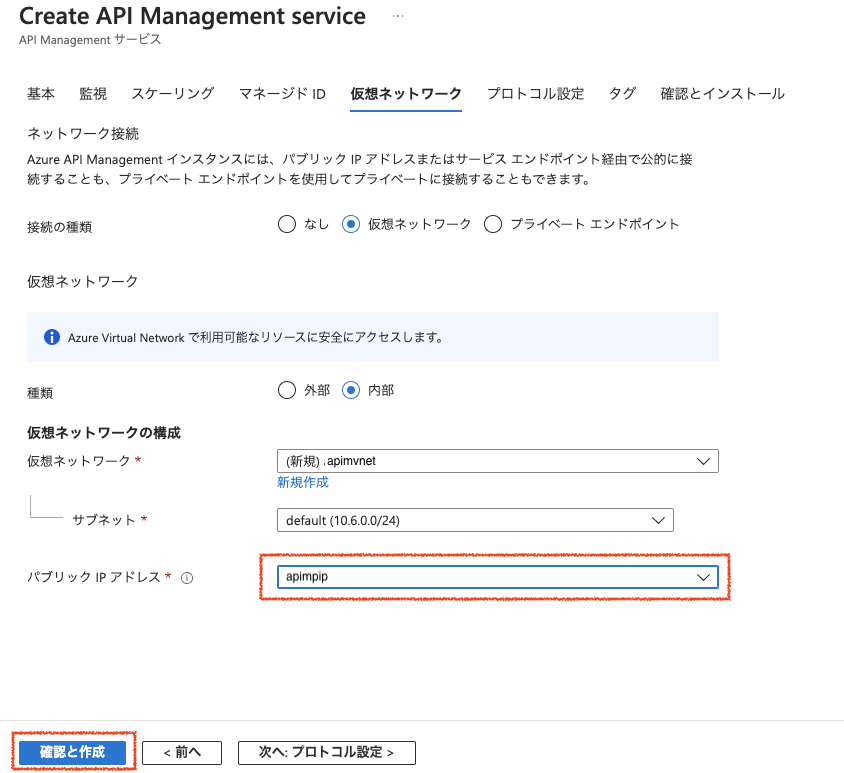

# 内部仮想ネットワークを利用するAzure API Managementのデプロイ

ネットワークの準備でやることは以下の通りです

1. パブリックIPアドレスの作成
2. Azure API Managementのデプロイ

## 1. パブリックIPアドレスの作成

### 1.1 AzureポータルでパブリックIPアドレスの作成を開始

Azureポータル画面でリソースグループを選択し、右Pane上部の「+作成」ボタンをクリックします。

### 1.2 マーケットプレイスの検索フィールドに「パブリックIP」と入力し、一覧から「パブリックIPアドレス」を選択

### 1.3 「作成」ボタンをクリック

### 1.4 パラメータを入力してパブリックIPアドレスを作成

|名称|値|
|---|---|
|名前|apimpip|
|IPバージョン|IPv4|
|SKU|Standard|
|可用性ゾーン|Zone-redundant|
|レベル|Regional|
|IPアドレスの割り当て|静的|
|ルーティングの優先順位|Microsoftネットワーク|
|アイドルタイムアウト|4 (デフォルト値のまま)|
|DNS名ラベル|一意になる名称|

上記パラメータを入力して画面下部の「作成と確認」ボタンをクリックします。

確認が終了したら、画面下部の「作成」ボタンをクリックします。

## 2. Azure API Managementのデプロイ

### 2.1 Azureポータルで仮想ネットワークの作成を開始
リソースグループの画面に戻り、右Pane上部の「+作成」ボタンをクリックします。

### 2.2 マーケットプレイスの検索フィールドに「api management」と入力し、一覧から「API Management」をクリック

### 2.3 基本タブ

__プロジェクトの詳細__
|名称|値|
|---|---|
|サブスクリプション| ハンズオンで利用するサブスクリプションを選択|
|リソースグループ|ハンズオンで利用するリソースグループを選択。新規作成する場合は、「新規作成」をクリックしてリソースグループを入力   |

__インスタンスの詳細__
|名称|値|
|---|---|
|リージョン|ハンズオンで利用するリージョンを選択。例）東日本|
|リソース名|APIMのリソース名を入力。このリソース名がドメイン名の元になるので、Azure上で一意となる名称。 例)apimws20230401、mynameapimws ドメイン名の例）apimws20230401.azure-api.net|
|Organization Name|開発者ポータルのタイトルや通知メールに使われるので、わかりやすい名前をつける。Azureで一意である必要はない。|
|管理者のメールアドレス|APIMからの通知が送信されるメールアドレス。ワークショップ参加者の受信可能なメールアドレスを設定。|
|**価格レベル**||
|価格レベル|Developer（SLAなし）を選択|

必要な項目を入力したら、*監視、スケーリング、マネージドIDの設定は飛ばして* 「仮想ネットワーク」タブをクリック

### 2.4 仮想ネットワークタブで内部を選択し、仮想ネットワークを作成

接続の種類で「内部」を選択し、下部に表示された仮想ネットワーク構成の仮想ネットワークプルダウンの「新規作成」のリンクをクリックして、仮想ネットワーク設定のダイアログを表示。

|名称|値|
|---|---|
|名前|apimvnet|
|アドレス空間|デフォルトのまま|
|サブネット|デフォルトのまま|

ダイアログ下部の「OK」ボタンをクリックします

### 2.5 仮想ネットワークタブでパブリックIPアドレスを指定

|名称|値|
|---|---|
|__ネットワーク接続__|
|接続の種類|仮想ネットワーク|
|__仮想ネットワーク__|
|種類|内部|
|__仮想ネットワークの構成__|
|仮想ネットワーク|apimvnet（ダイアログで作成した仮想ネットワーク）|
|サブネット|default|
|パブリックIPアドレス|apimvnet (前の手順で作成したパブリックIPをプルダウンメニューから選択)|

*プロトコル設定、タグの設定は飛ばして*　「確認とインストール」タブをクリック

#### 2.5. 確認とインストールタブ
入力内容のチェックが終わると、画面下部の「作成」ボタンが有効になるので「作成」ボタンをクリックしてAPIMの作成を開始

