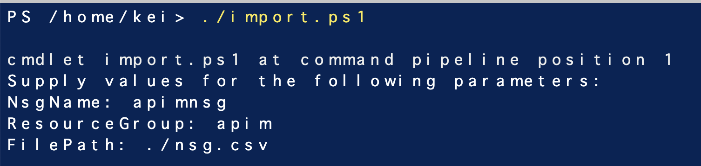
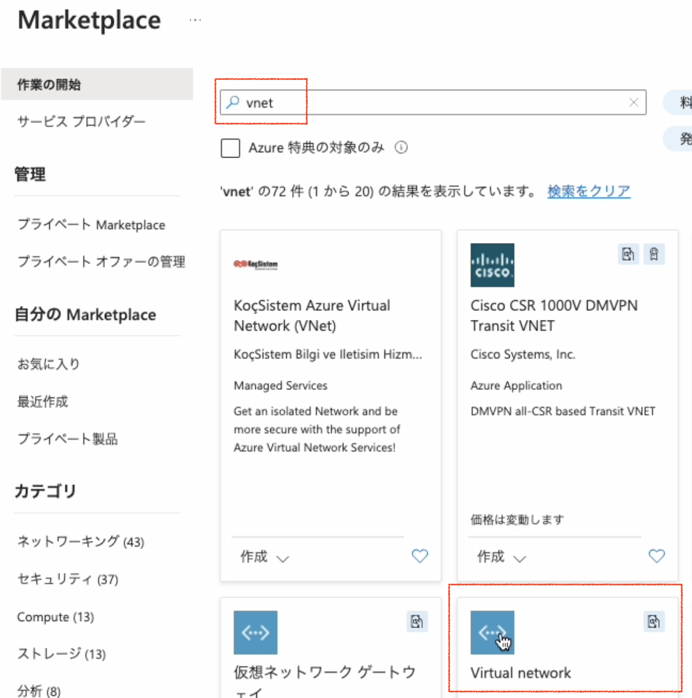
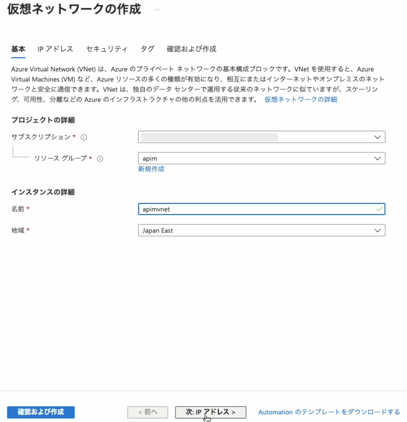
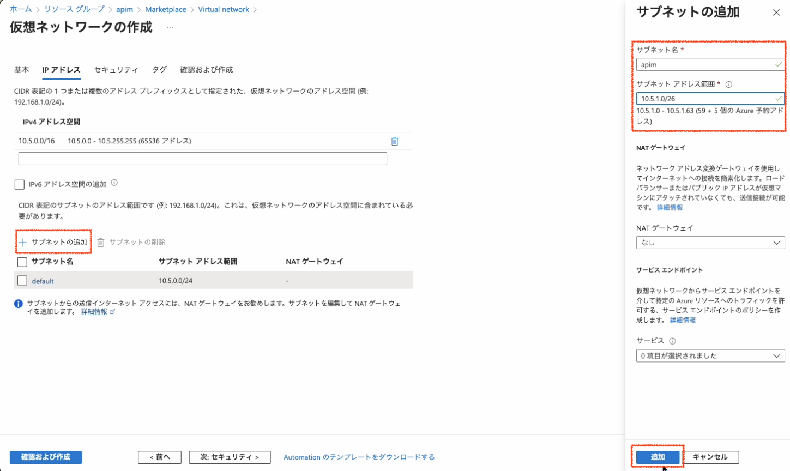
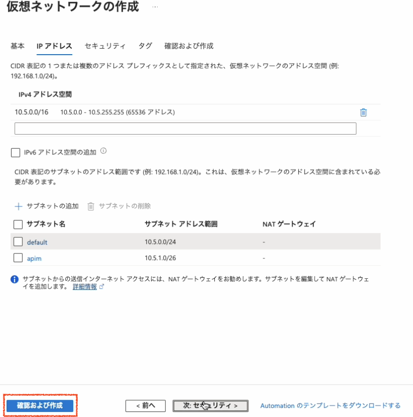
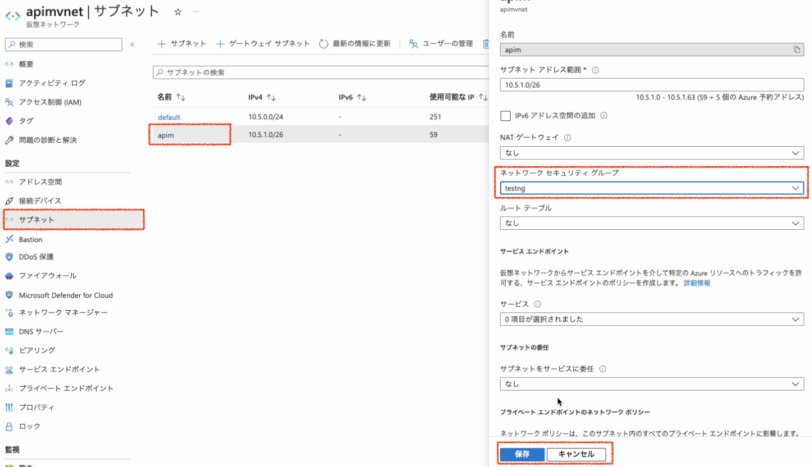
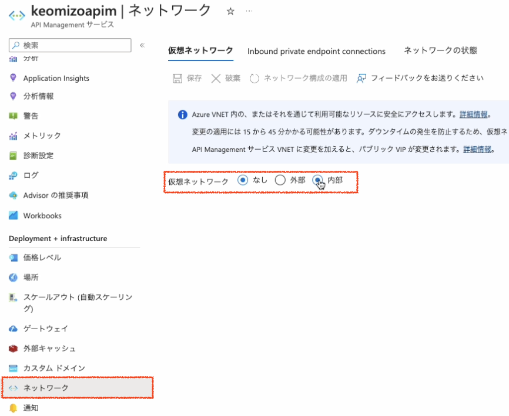
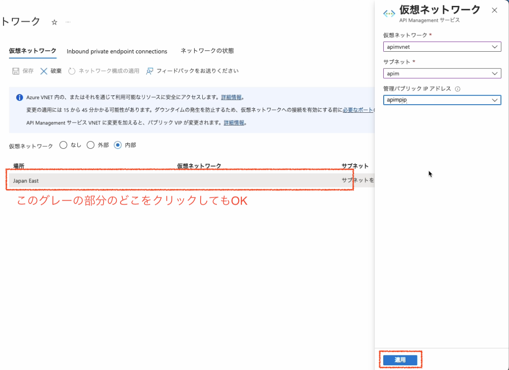
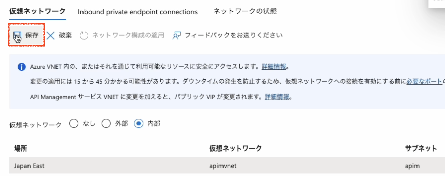

# Azure API Managementのネットワークの変更

VNETを利用してないAzure API Managementのネットワークの変更でやることや以下の通りです。

0. Cloud Shellの準備
1. ネットワークセキュリティグループ(NSG)の作成
2. パブリックIPアドレスの作成
3. 仮想ネットワーク(VNET)の作成とNSGの割り当て
4. Azure API Managementのネットワークの更新

## 0. Cloud Shellの準備

作業用の環境にAzure CLIがインストールされていない場合は、Cloud Shellを利用すると便利です。

[Azure Cloud Shellのクイックスタート](https://learn.microsoft.com/ja-jp/azure/cloud-shell/quickstart?tabs=azurecli)　を参考に、Cloud Shellの環境を準備します。


## 1. ネットワークセキュリティグループ(NSG)の作成

### 1.1 ポータル画面場部の 「>_」アイコンをクリックして、Cloud Shellを開始


### 1.2 NSGの設定ファイル(CSV)とインポート用スクリプトをダウンロード

次のコマンドをCloud Shellで実行して、設定ファイル(CSV)とインポート用スクリプト(import.ps1)をダウンロードします

```
wget https://raw.githubusercontent.com/akubicharm/azure-apim-workshop/main/apim-vnet-internal/solution/import.ps1

wget https://raw.githubusercontent.com/akubicharm/azure-apim-workshop/main/apim-vnet-internal/solution/nsg.csv
```

### 1.3 `import.ps1` を使ってNSGをインポート

`import.ps1` をCloudShell (PowerSellモード)で起動します。NSG、リソースグループ、CSVファイルをプロンプトに入力します。

|名前|値|
|---|---|
|NsgName|apimng|
|ResourceGroup|APIMがデプロイされているリソースグループ名|
|FilePath|./nsg.csv|



## 2. パブリックIPアドレスの作成

### 2.1 AzureポータルでパブリックIPアドレスの作成を開始

Azureポータル画面でリソースグループを選択し、右Pane上部の「+作成」ボタンをクリックします。


### 2.2 マーケットプレイスの検索フィールドに「パブリックIP」と入力し、一覧から「パブリックIPアドレス」を選択


### 2.3 「作成」ボタンをクリック


### 2.4 パラメータを入力してパブリックIPアドレスを作成


|名称|値|
|---|---|
|名前|apimpip|
|IPバージョン|IPv4|
|SKU|Standard|
|可用性ゾーン|Zone-redundant|
|レベル|Regional|
|IPアドレスの割り当て|静的|
|ルーティングの優先順位|Microsoftネットワーク|
|アイドルタイムアウト|4 (デフォルト値のまま)|
|DNS名ラベル|一意になる名称|

上記パラメータを入力して画面下部の「作成と確認」ボタンをクリックします。

確認が終了したら、画面下部の「作成」ボタンをクリックします。


## 3. 仮想ネットワークの作成とNSGの割り当て

### 3.1 Azureポータルで仮想ネットワークの作成を開始
リソースグループの画面に戻り、右Pane上部の「+作成」ボタンをクリックします。


### 3.2  マーケットプレイスの検索フィールドに「VNET」と入力し、一覧から「Virtual Network」を選択



次の画面で「作成」ボタンをクリックして作成を開始します。

### 3.3 仮想ネットワークの作成ダイアログでパラメータを入力

#### 基本タブ

|名称|値|
|---|---|
|__プロジェクトの詳細__|
|サブスクリプション|このワークショップで利用するサブスクリプションを選択|
|リソースグループ|このワークショップで利用するリソースグループを選択|
|__インスタンス詳細__|
|名前|apimvnet|
|地域|Japan East|

上記を入力し、画面下部の「次: IPアドレス>」をクリック



#### IPアドレスタブ

画面中央あたりの「+サブネットの追加」をクリックしてサブネットの追加ダイアログを表示し、サブネットのパラメータを入力

|名称|値|
|---|---|
|サブネット名|apim|
|サブネットのアドレス範囲|10.X.1.0/26 (Xの部分は、VNETのアドレス空間に合わせる)<br>VNetのアドレス空間が10.1.0.0の場合は、10.1.1.0/26|

ダイアログ下部の「追加」ボタンをクリック




追加したサブネットが一覧に表示されされていることを確認し、画面下部の「確認および作成」ボタンをクリックし、「検証に成功しました」と表示されたら画面下部の「作成」ボタンをクリックします。




### 3.4 サブネットにネットワークセキュリティグループを割り当て

仮想ネットワークの管理画面の右Paneで「サブネット」をクリックしサブネット一覧を表示し、サブネット一覧から「apim」を選択します。
表示されたダイアログのネットワークセキュリティグループのプルダンから、「1」の手順で作成したネットワークセキュリティグループを選択し、ダイアログ下部の「保存」ボタンをクリックします。



## 4. Azure API Managementのネットワークの更新

### 4.1 Azureポータルでワークショップで利用するAPIMを選択

### 4.2 右Paneのネットワークをクリックし、仮想ネットワークのラジオボタンで「内部」にチェック



### 4.3 一覧の「サブネットを選択してください」をクリックし、仮想ネットワーク設定ダイアログでパラメータを入力

前の手順で作成した仮想ネットワーク、サブネット、管理パブリックIPアドレスを入力し、画面下部の「適用」ボタンをクリックします

|名称|値|
|---|---|
|仮想ネットワーク|apimvnet|
|サブネット|apim|
|管理パブリックIPアドレス|apimpip|




### 4.4 仮想ネットワークタブの「保存」ボタンをクリックして設定を保存




---
<a href="readme.md">↑メニュー</a>
<a href="setup-appgw.md">次へ→</a>