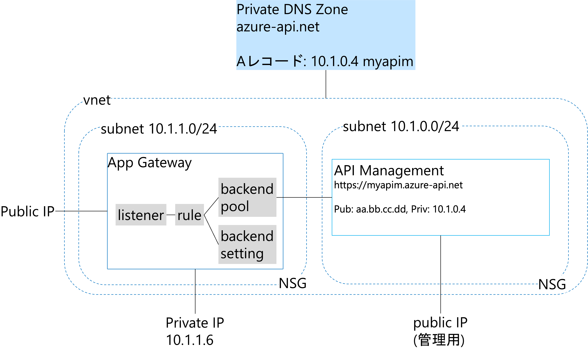

# Azure API Managementのネットワークを内部仮想ネットワークに設定する

既存のAzure API Managementのネットワークを内部仮想ネットワークに変更していきます。

1. [ネットワークの準備](./prepare-network.md)
2. [Azure API Management のネットワークの変更](./apim-update-network.md)　または [内部仮想ネットワークを利用するAzure API Managementをデプロイ](./apim-deploy-vnet-internal.md)
3. [Application Gatewayのデプロイ](./setup-appgw.md)
4. [動作確認](./validate-apim-vnet-internal.md)