# Azure Application Gatewayのデプロイ

1. プライベートDNSゾーンの作成
2. 仮想ネットワークにサブネットを追加
3. Azure Application GatewayのデプロイとBasicなリスナーの設定）
4. Azure Application GatewayのパスベースのURLルーティングの設定

## 1. プライベートDNSゾーンの作成と設定

### 1.1 https://portal.azure.com/#create/Microsoft.PrivateDnsZone-ARM にアクセスして、プライベートDNSゾーンの作成を開始

### 1.2 基本タブ

|名称|値|
|---|---|
|サブスクリプション|このワークショップで利用するサブスクリプション|
|リソースグループ|このワークショップで利用するリソースグループ|
|__インスタンスの詳細__|
|名称|azure-api.net|

上記を入力し、画面下部の「確認および作成」ボタンをクリックし、検証が完了したら画面下部の「作成」ボタンをクリックします。

作成が終わったら「リソースに移動」ボタンをクリックし、プライベートDNSゾーンの管理画面を表示します。

### 1.2 プライベートDNSゾーンの管理画面の左Paneで「仮想ネットワークリンク」をクリックし、表示された右Pane上部の「+追加」をクリック

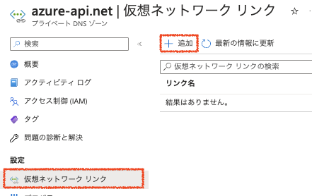

### 1.3 Azure API Managementが利用している仮想ネットワークにリンク

|名称|値|
|---|---|
|リンク名|apim|
|サブスクリプション|このワークショップで利用するサブスクリプション|
|仮想ネットワーク|apimvnet (APIMが利用している仮想ネットワーク)|
|構成|自動登録を有効にするにチェック|

上記を入力し、画面下部の「OK」ボタンをクリックします。

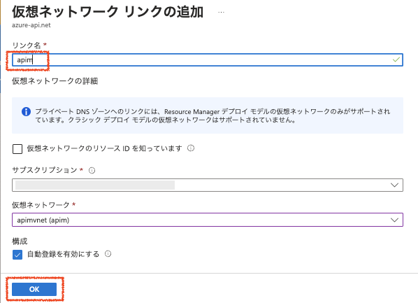

### 1.4 プライベートDNSゾーンにAzure API ManagementのプライベートIPを登録

プライベートDNSゾーンでApplication Gateway -> API Managementの名前解決が出入るようにレコードを追加します。

画面上部の「+レコードセット」をクリックし、レコードセットの追加ダイアログでパラメータを入力します。

|名称|値|
|---|---|
|名前|デプロイ済みのAzure API Management のFQDNの先頭 例) myapim.azure-api.net ならば myapim|
|種類|A - IPv4アドレスへのエリアスレコード|
|TTL|1|
|TTLの単位|時間|
|IPアドレス|Azure API ManagementのプライベートIPアドレス|

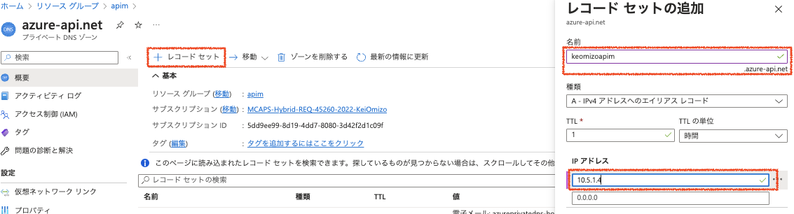

## 2. 仮想ネットワークにサブネットを追加

### 2.1 Azure管理ポータルでワークショップで利用するリソースグループを表示し、リソース一覧からAzure API Managementが利用している仮想ネットワークを選択

### 2.2 仮想ネットワークの管理画面左Paneの「サブネット」をクリックし、サブネット一覧を表示
### 2.3 左Paneの「+サブネット」をクリックしサブネットの追加ダイアログでパラメータを入力

|値|名前|
|---|---|
|名前|appgw|
|その他の項目|デフォルトのまま|

ダイアログ下部の「保存」ボタンをクリックします。

## 3. Azure Application Getewayのデプロイ

### 3.1 リソースグループの管理画面上部の「+作成」をクリック
### 3.2 マーケットプレイスの検索フィールドに「application gateway」と入力し、一覧から「Application Gatewayを選択し、次に表示された画面で「作成」ボタンをクリック

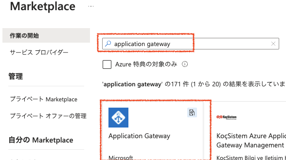
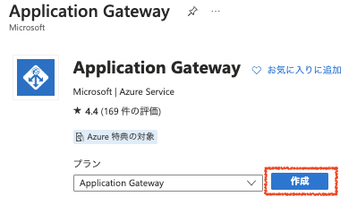

### 3.3 基本タブ

|名称|値|
|---|---|
|サブスクリプション|このワークショップで利用するサブスクリプション|
|リソースグループ|このワークショップで利用するリソースグループ|
|__インスタンスの詳細__|
|ゲートウェイ名|appgw|
|地域|Japan East|
|レベル|Standard v2|
|自動スケール|はい|
|最小インスタンス数|0 （デフォルトのまま）|
|最大インスタンス数|10　（デフォルトのまま）|
|可用性ゾーン|なし|
|Http2|無効|
|__仮想ネットワークの構成__|
|仮想ネットワーク|apimvnet (前の手順でサブネットを追加したVNET)|
|サブネット|appgw (前の手順で作成したサブネット)|

上記を入力し画面下部の「次 : フロントエンド >」をクリック

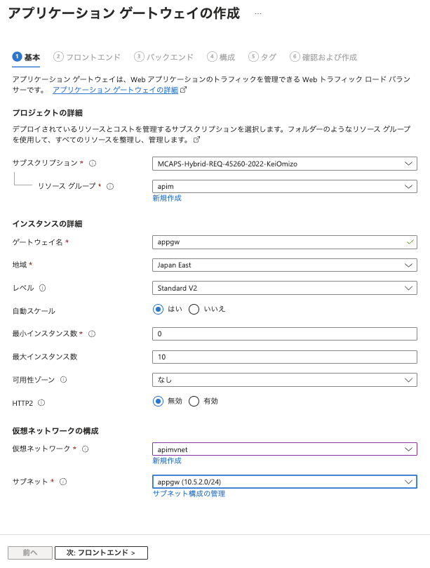

### 3.4 フロントエンドタブ

|名称|値|
|---|---|
|フロントエンドIPの種類|両方|
|パブリックIPアドレス|画面下部の「新規追加」をクリックしパブリックIPの追加ダイアログで名前を入力し「OK」ボタンをクリック 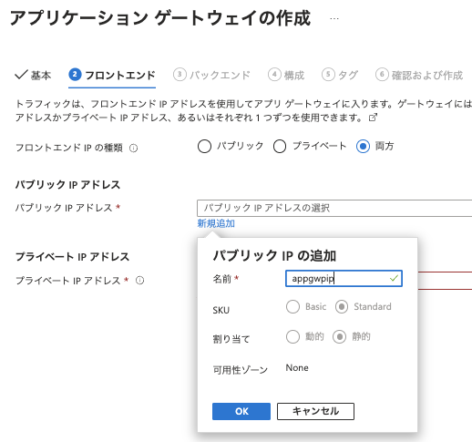|
|プライベートIPアドレス|10.x.x.6 （サブネットの範囲内のアドレス。先頭5つはリザーブされているので6以上の値)|

上記を入力し「次 : バックエンド >」をクリックします

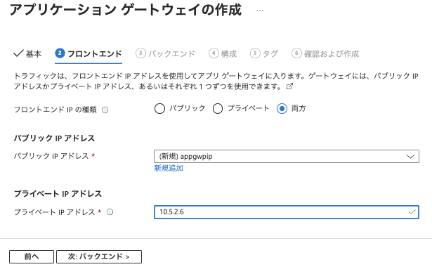

### 3.5 バックエンドタブ

「バックエンドプールの追加」をクリックしてバックエンドプールの追加ダイアログを表示し、パラメータを入力します。

|名称|値|
|---|---|
|名称|apimpool|
|ターゲットを持たないバックエンドプールを追加します|いいえ|
|__バックエンドターゲット__|
|ターゲットの種類|IPアドレスまたはFQDN|
|ターゲット|xxxx.azure-api.net  ※Azure API ManagementのFQDNを指定|

上記を入力して「追加」ボタンをクリックし、バックエンドタブに戻ったら画面下部の「次 : 構成 >」ボタンをクリックします。

### 3.6 画面中央の「ルーティング規則の追加」ボタンをクリック

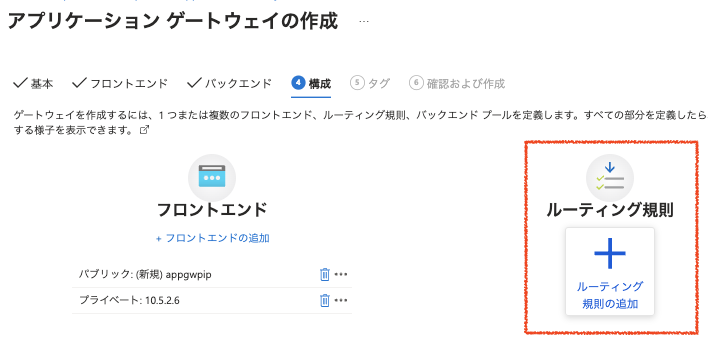

### 3.7 構成タグで「ルーティング規則の追加」をクリックし、ルーティング規則の追加ダイアログでリスナーのパラメータを入力

|名称|値|
|---|---|
|ルール名|apimrule|
|優先度|100|
|__リスナー__|
|リスナー名|apimlistener|
|フロントエンドIP|パブリック|
|ポート|80|
|__追加設定__|
|リスナーの種類|Basic|
|エラーページのURL|いいえ|

バックエンドターゲットタブをクリックし、続けてバックエンドターゲットのパラメータを入力します。

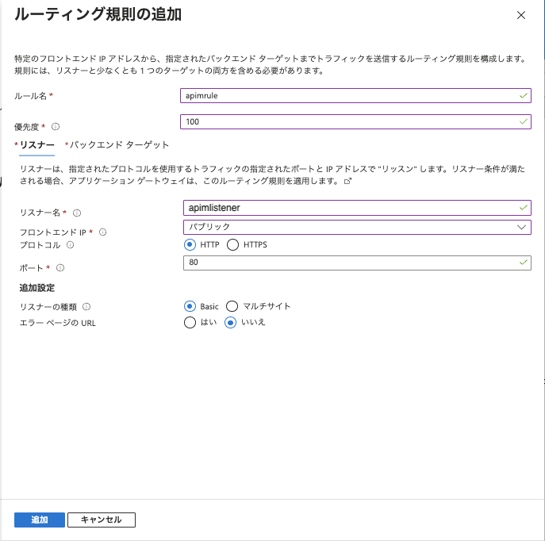

### 3.7 バックエンドターゲットタブを開き、バックエンド設定の「新規追加」をクリック

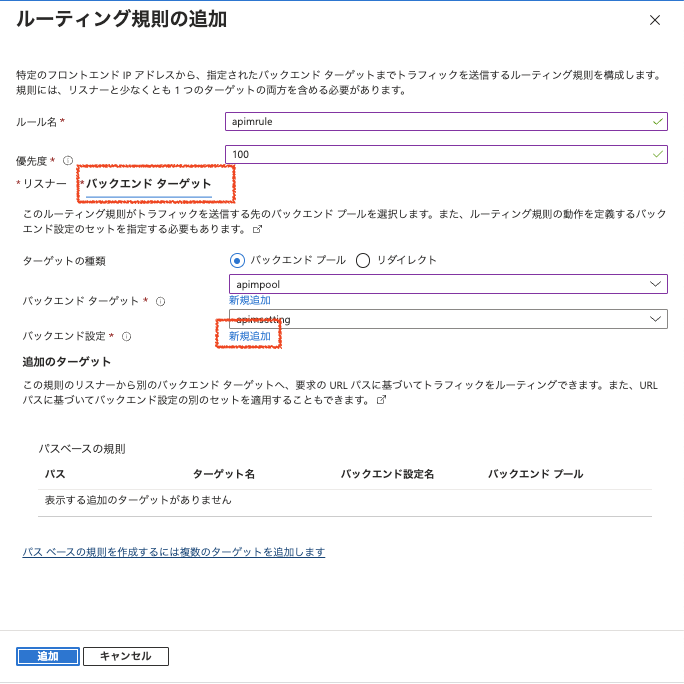

### 3.8　バックエンドターゲットタブでバックエンドターゲットのパラメータを入力

バックエンドターゲットタブのバックエンド設定入力フィールドの「新規追加」をクリックし、バックエンド設定を入力します。
|名称|値|
|---|---|
|バックエンド設定名|apimsetting|
|バックエンドプロトコル|HTTPS|
|バックエンドポート|443|
|__信頼されたルート証明書__|
|既知のCA証明書を使用する|はい|
|__追加設定__|
|Cookieベースのアフィニティ|無効化　（デフォルトのまま）|
|接続のドレイン|無効化　（デフォルトのまま）|
|要求のタイムアウト|20　（デフォルトのまま）|
|バックエンドパスのオーバーライド|（空白）　（デフォルトのまま）|
|__ホスト名__|
|新しいホスト名でオーバーライドする|はい|
|ホスト名をオーバーライドする|バックエンドターゲットからホスト名を選択する|
|カスタムプローブを作成する|はい|

上記を入力し、画面下部の「追加」ボタンをクリックします。

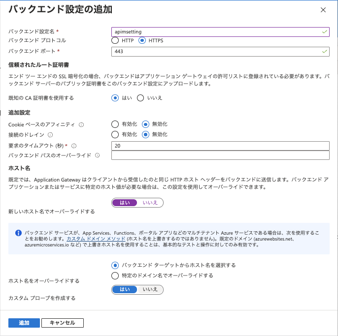

### 3.9 ルーティング規則の追加画面に戻り、画面下部の「追加」ボタンをクリック

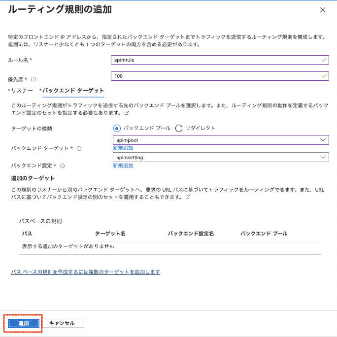

### 3.8 構成タブで「次 : タグ>」ボタンをクリックしてタグのタブを表示し、画面下部の「次 : 確認および作成 >」ボタンをクリック

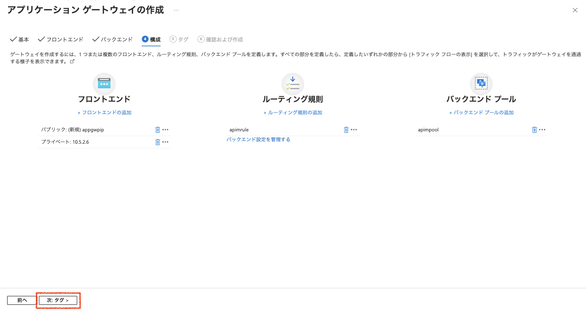
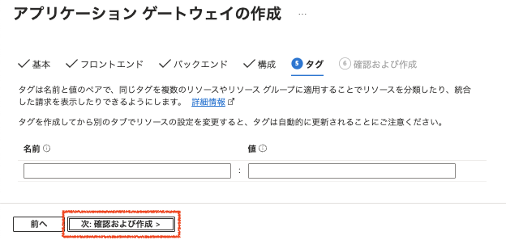

### 3.9 検証が終わったら画面下部の「作成」ボタンをクリックしてApplication Gatewayを作成

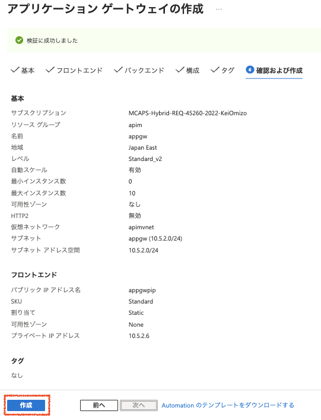

### 3.10 Application Gatewayの管理画面の左Paneで「正常性プローブ」を選択し、右Pane上部の「+追加」をクリック
### 3.11 正常性プローブの追加ダイアログでパラメータを入力し「テスト」ボタンをクリック

|名称|値|
|---|---|
|名前|apimprobe|
|プロトコル|HTTPS|
|バックエンド設定からホスト名を選択する|はい|
|ポートをバックエンド設定から選択する|はい|
|パス|/httpbin/newapp|
|間隔（秒）|30 （デフォルト）|
|タイムアウト（秒）|30（デフォルト）|
|異常しきい値|3（デフォルト）|
|プローブの一致条件を使用|いいえ|
|バックエンド設定|apimsetting|

上記を入力し「正常性プローブを追加する前にバックエンドの正常性をテストする」にチェックして「テスト」ボタンをクリックします。

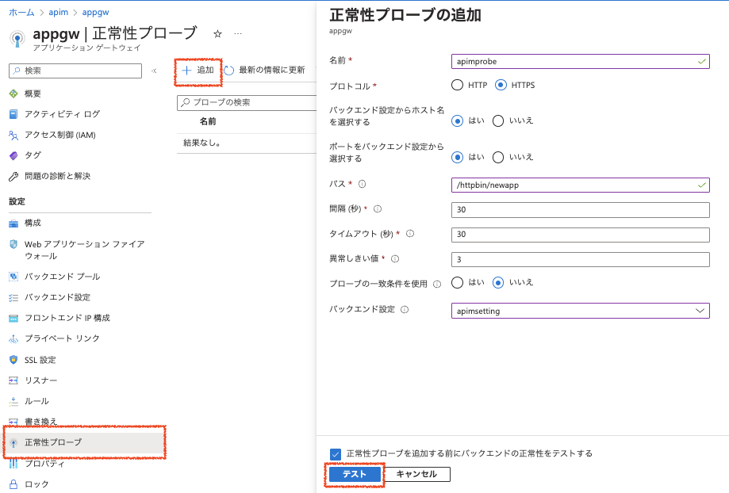

### 3.12 テストが正常終了したら「追加」ボタンをクリックしてプローブを追加

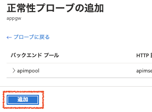

## 4. Application GatewayのパスベースのURLルーティングの設定

### 4.1 リスナーの追加

Application Gatewayの管理画面の右Paneで「リスナー」をクリックし、左Pane上部の「+リスナーの追加」をクリックしてリスナーを追加します。

パラメータを入力し「追加」ボタンをクリックします。

|名称|値|
|---|---|
|リスナー名|extlistener|
|フロントエンドIP|パブリック|
|プロトコル|HTTP|
|ポート|8080|
|追加設定|
|リスナーの種類|マルチサイト|
|ホストの種類|単一|
|ホスト名|ext.example.com|
|エラーページのURL|いいえ|

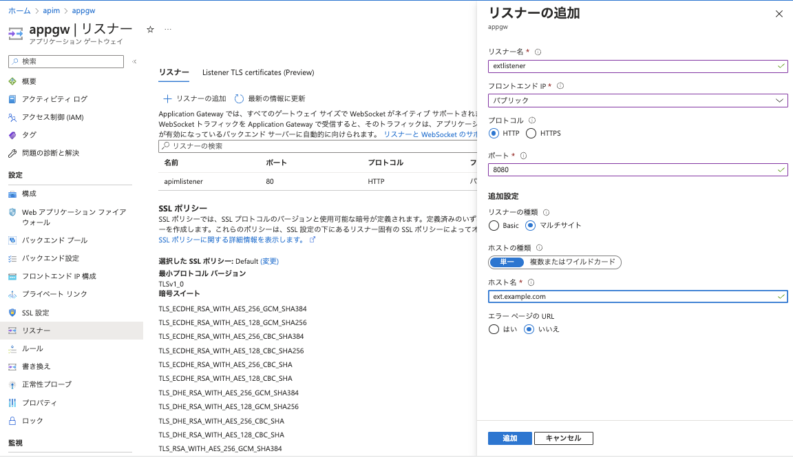

### 4.