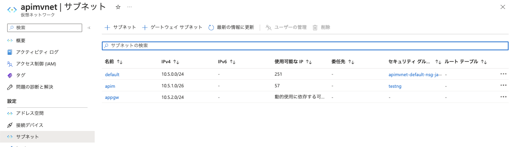
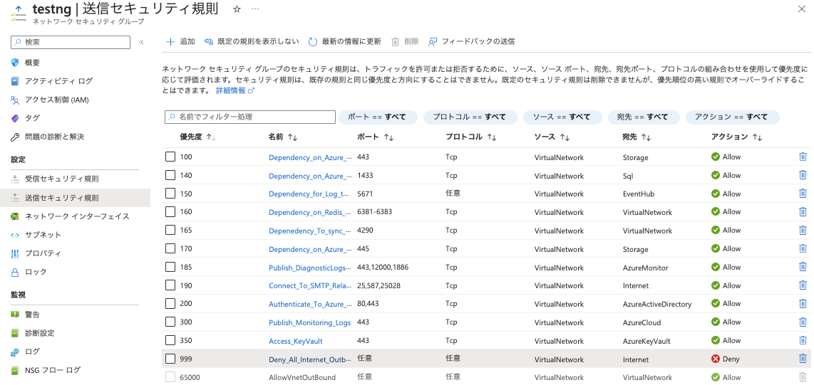
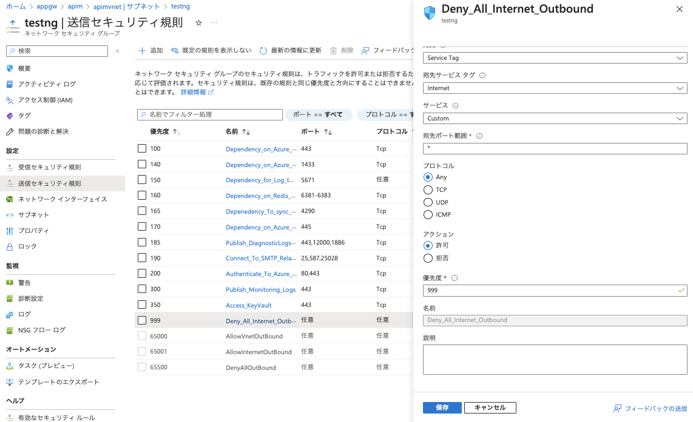

# 内部仮想ネットワーク接続したAPIMにAzure Application Gateway経由での接続の動作確認

2. Application GatewayのパブリックIPからAPIをコールする

<!--
1. Azure APIM Managementのネットワークセキュリティグループを変更 
※外部APIの呼び出しを可能にする（これは動作確認のためなので、本番構成ではPrivate Endpointやルーティング設定などをする）

2. Application GatewayのパブリックIPからAPIをコールする

## 1. Azure API Mamagementのネットワークセキュリティグループを変更

### 1.1 APIM が利用しているVNETを選択

### 1.2 左Paneの「サブネット」をクリックしサブネット一覧を表示する

### 1.3 apim の行のセキュリティグループをクリックしてネットワークセキュリティグループの管理画面を表示し、左Paneで「送信セキュリティ規則」をクリック

### 1.4 送信セキュリティのDeny_All_Internet_Outbountをクリックし、アクションで「許可」をチェックし「保存」ボタンをクリック

-->

## 1. Application GatewayのパブリックIPからAPIを呼ぶ

### 1.1 Application Gatewayの管理画面を表示し、パブリックIPアドレスを確認

### 1.2 Mockレスポンスを返すAPIにブラウザからアクセス

以前のワークショップでMockレスポンスを返すAPIを定義している場合は、`/httpbin/newapp` のコンテキストパスでMockレスポンスを返すAPIにアクセスできるので、`http://[Application GatewayのパブリックIPアドレス]/httpbin/newapp` にアクセスする。

---
<a href="setup-appgw.md">←戻る</a>
<a href="readme.md">↑メニュー</a>