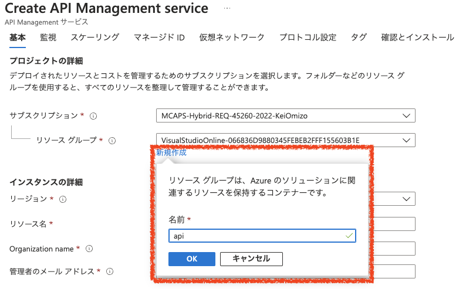
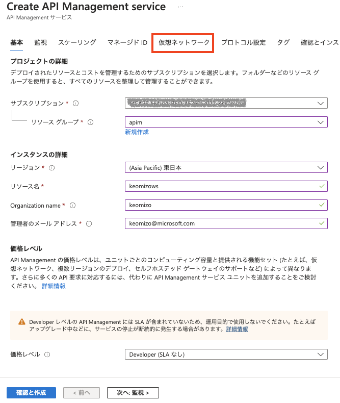
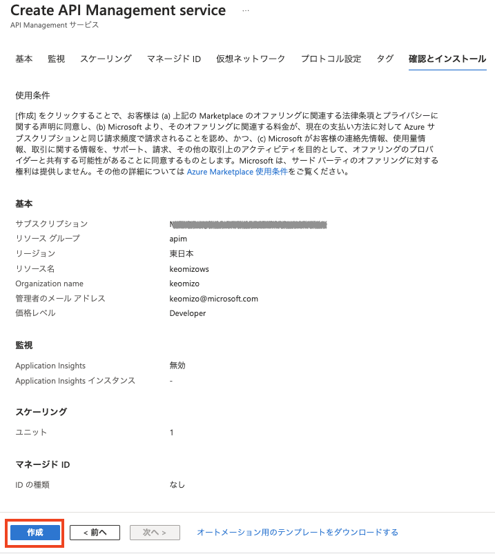

# Azure API Management のデプロイ

## Azureポータルでのデプロイ

[Azure API ManagementをAzureポータルでデプロイする](https://learn.microsoft.com/ja-jp/azure/api-management/get-started-create-service-instance) を参考にして、APIM をデプロイします。

#### 1. このボタンをクリックして、APIM のデプロイを開始　　

#### 2. 基本タブ

|プロジェクト詳細| |
|---|---|
|サブスクリプション| ハンズオンで利用するサブスクリプションを選択|
|リソースグループ|ハンズオンで利用するリソースグループを選択。新規作成する場合は、「新規作成」をクリックしてリソースグループを入力 |

|インスタンス詳細||
|---|---|
|リージョン|ハンズオンで利用するリージョンを選択。例）東日本|
|リソース名|APIMのリソース名を入力。このリソース名がドメイン名の元になるので、Azure上で一意となる名称。 例)apimws20230401、mynameapimws ドメイン名の例）apimws20230401.azure-api.net|
|Organization Name|開発者ポータルのタイトルや通知メールに使われるので、わかりやすい名前をつける。Azureで一意である必要はない。|
|管理者のメールアドレス|APIMからの通知が送信されるメールアドレス。ワークショップ参加者の受信可能なメールアドレスを設定。|
|**価格レベル**||
|価格レベル|Developer（SLAなし）を選択|

*監視、スケーリング、マネージドIDの設定は飛ばして、仮想ネットワークの設定*

#### 3. 仮想ネットワークタブ
接続の種類で「なし」を選択。

※「なし」の場合は、PublicなインターネットからAPIMに接続可能。実プロジェクトで閉域で利用する場合には、仮想ネットワークやプライベートエンドポイントでを選択することが多い。

*プロトコル設定、タグの設定は飛ばして確認とインストール*

#### 4. 確認とインストールタブ
入力内容のチェックが終わると、画面下部の「作成」ボタンが有効になるので「作成」ボタンをクリックしてAPIMの作成を開始

## 簡単な動作確認

APIM がデプロイできたら、セットアップ済みのデモAPIを読んでみます。

1. AzureポータルでAPIMをデプロイしたリソースグループを選択
2. リソース一覧からAPIMを選択
3. APIMの管理ポータル画面の左Paneで「API」をクリック
4. APIMの管理ポータルの右Paneで「Echo API」をクリック
5. APIMの管理ポータルの右Paneの「Test」タブをクリック
6. All Operations の一覧の上から5番目の「GET Retrieve resource」をクリック
7. 一番右のビューを下までスクロールして「Send」ボタンをクリック
8. 200 OK が返ってくることを確認

<video controles src="https://user-images.githubusercontent.com/7894259/229988379-8db12a41-4ce5-4431-bbb0-89165c0a85da.mp4"></video>

